# impactR4PHU <a href='https://www.impact-initiatives.org'></a>

<!-- badges: start -->

[](code_of_conduct.md)
[](https://github.com/impact-initiatives/impactR4PHU/actions/workflows/R-CMD-check.yaml)
[](https://codecov.io/gh/impact-initiatives/impactR4PHU)
[](https://github.com/impact-initiatives/impactR4PHU/actions/workflows/check_release.yaml)
[](https://github.com/impact-initiatives/impactR4PHU/actions/workflows/check_standard.yaml)
<!-- badges: end -->

## Overview

`impactR4PHU` is designed for creating quality check reports, cleaning,
analysing and outputing results of core outcome indicators of Public
Health Unit. This package will target mainly Food Security and
Livelihoods, WASH, Nutrition and Health Sectors.

## Table of Contents

- [Installation](#installation)
  - R Tools Version
  - Package Installation
- [Projects](#projects)
  - [Data Quality](#data-quality)
    - Execution
    - FSL
    - Mortality
    - IYCF
  - [Cleaning](#cleaning)
    - Execution
    - FSL
    - Mortality
    - IYCF
  - [Descriptive Analysis](#descriptive-analysis)
    - Execution
    - FSL
    - Mortality
    - IYCF
  - [Integrated Public Health Tables](#integrated-public-health-tables)
    - Execution
  - [IPHRA](#iphra)
    - Quality Report and Plausibility Checks
    - Cleaning
    - Analysis
- [Potential Errors and How to fix
  them](#potential-errors-and-how-to-fix-them)
- [Standalone Functions](#standalone-functions)
  - [FSL ADD INDICATORS](#fsl-add-indicators)
    - FCS: Food Consumption Score
    - HHS: Household Hunger Scale
    - rCSI: Reduced Coping Strategy Index
    - LCSI: Livelihood Coping Strategy Index
    - HDDS: Household Dietary Diversity Score
    - FCM: Food Consumption Matrix
    - FCLCM: Food Consumption Livelihood Matrix
  - [Nutrition ADD INDICATORS](#nutrition-add-indicators)
    - MUAC: Mid-Upper Arm Circumference
    - MFAZ: MUAC for Age z-score
    - IYCF: Infant and Young Child Feeding Scores
  - [Checking Flags](#checking-flags)

## Installation

### R Tools Version

The projects inside this package all requires a minimum R 4.4.0 Version.
So, please make sure to update your R to the latest version from this
[link](https://cran.r-project.org/bin/windows/base/).

### Package Installation

You can install the development version from
[GitHub](https://github.com/) with:

``` r
# install.packages("devtools")
devtools::install_github("impact-initiatives/impactR4PHU")
```

## Projects

Upon installing the impactR4PHU package, you will be able to access
pre-coded projects related to the various sectors of Public Health.
These projects aims to support country missions and the research
department to check/clean/and analyse indicators related to Public
Health sectors.

To access these projects, follow the following instructions.

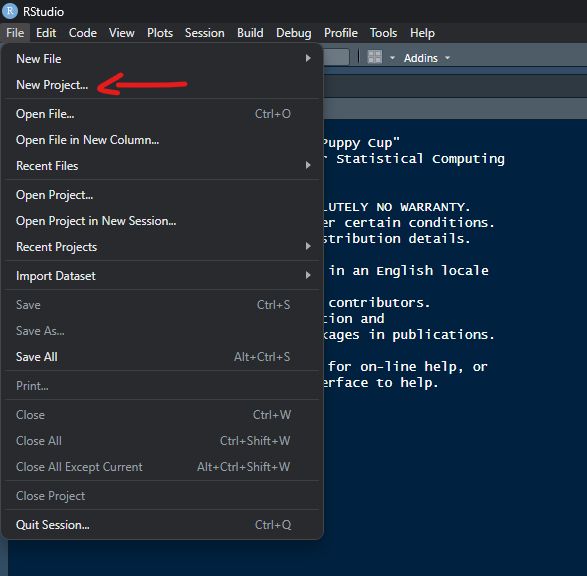


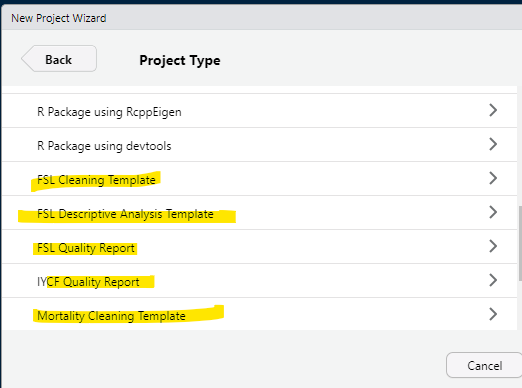

### Data Quality

The Data Quality and Plausibility Report serves as a crucial tool for
assessing the reliability and accuracy of the data collection of all
related public health indicators across different assessments. This
comprehensive analysis is designed to identify and address potential
issues within the data, ensuring that field teams are being informed on
potential issues detected in the data collection.

The report provides a detailed examination of the datasets, employing a
variety of metrics and methodologies to evaluate data quality and
plausibility. This includes checks for completeness, consistency, and
accuracy of the data collected. This report aims to uncover any
discrepancies, outliers, or anomalies that may suggest data collection,
entry errors, or underlying issues that could impact the integrity of
the findings.

#### Execution

Once the project is selected and saved as shown in the previous section,
automatically the respective file that you need to run will open. First
thing, you should select all the line codes in the file, and click run
as shown in the following picture.

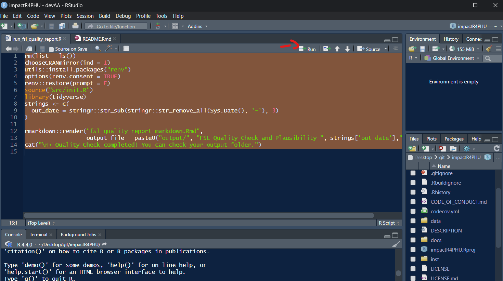

The next step will requires you to answer/click/select/input some
information related to the sector that you are trying to check the
quality for. Generally this will include:
<ul>
<li>
Raw Data to check
</li>
<li>
Kobo Tool respective for the raw data
</li>
<li>
Inputs of specific columns/values that will be targeted within the
quality check.
</li>
</ul>

Details of all the inputs will be explained in each sector’s section
below.

#### FSL Section

After running all the line in the run_fsl_quality_report.R, below are
the set of inputs that are required for you to select/fill.
<strong>Please note that if the script is asking for a value that is not
in your data, then you should select cancel. However, make sure with the
respective focal point if these variables are required to get the
desired output.</strong>

<details>
<summary>
<h4>
Details
</h4>
</summary>

> `Raw Data` \<- Raw Data.<br> `Kobo Tool` \<- Kobo Tool.<br>
> `FSL indicators sheet` \<- Sheet that includes all the FSL
> indicators.<br> `Label column to choose` \<- Label you want to choose
> from the kobo tool.<br> `FSL indicators` \<- FSL indicators you have
> collected in your data.<br> `HH UUID column` \<- Household unique
> identifier (usually uuid).<br> If FCS selected<br> `fsl_fcs_cereal`\<-
> Cereal Column related to Food Consumption Score <br>
> `fsl_fcs_legumes`\<- Legumes Column related to Food Consumption Score
> <br> `fsl_fcs_veg`\<- Vegetables Column related to Food Consumption
> Score <br> `fsl_fcs_fruit`\<- Fruit Column related to Food Consumption
> Score <br> `fsl_fcs_meat`\<- Meat Column related to Food Consumption
> Score <br> `fsl_fcs_dairy`\<- Dairy Column related to Food Consumption
> Score <br> `fsl_fcs_sugar`\<- Sugar Column related to Food Consumption
> Score <br> `fsl_fcs_oil`\<- Oil Column related to Food Consumption
> Score <br> If rCSI selected<br> `fsl_rcsi_lessquality` \<- rCSI Less
> Quality Food Column<br> `fsl_rcsi_borrow` \<- rCSI Borrowing Food
> Column<br> `fsl_rcsi_mealsize` \<- rCSI Reducing Meal Size Column<br>
> `fsl_rcsi_mealadult` \<- rCSI Reduce Meals For Adults and Prioritize
> Child Meals Column<br> `fsl_rcsi_mealnb` \<- rCSI Reduce Meal Numbers
> Column<br> If HHS selected<br> `fsl_hhs_nofoodhh` \<- HHS No Food in
> the Household Column<br> `fsl_hhs_nofoodhh_freq` \<- HHS Frequency No
> Food in the Household Column<br> `fsl_hhs_sleephungry` \<- HHS
> Sleeping Hungry Column<br> `fsl_hhs_sleephungry_freq` \<- HHS
> Frequency Sleeping Hungry Column<br> `fsl_hhs_alldaynight` \<- HHS All
> Day and Night Without Eating Column<br> `fsl_hhs_alldaynight_freq` \<-
> HHS All Day and Night Without Eating Column<br> `Yes Value` \<- HHS
> Yes value<br> `No Value` \<- HHS No value<br> `Rarely Value` \<- HHS
> Frequency Rarely value<br> `Sometimes Value` \<- HHS Frequency
> Sometimes value<br> `Often Value` \<- HHS Frequency Often value<br> If
> LCSI selected: 4 LCSI Stress, 3 LCSI Crisis, and 3 LCSI Emergency are
> required<br> `fsl_lcsi_stress1` \<- LCSI Stress 1 Column<br>
> `fsl_lcsi_stress2` \<- LCSI Stress 2 Column<br> `fsl_lcsi_stress3` \<-
> LCSI Stress 3 Column<br> `fsl_lcsi_stress4` \<- LCSI Stress 4
> Column<br> `fsl_lcsi_crisis1` \<- LCSI Crisis 1 Column<br>
> `fsl_lcsi_crisis1` \<- LCSI Crisis 1 Column<br> `fsl_lcsi_crisis2` \<-
> LCSI Crisis 2 Column<br> `fsl_lcsi_emergency2` \<- LCSI Emergency 2
> Column<br> `fsl_lcsi_emergency3` \<- LCSI Emergency 3 Column<br>
> `fsl_lcsi_emergency3` \<- LCSI Emergency 3 Column<br> `Yes Value` \<-
> LCSI Yes value<br> `No Value` \<- LCSI No had no need value<br>
> `Exhausted Value` \<- LCSI No exhausted value<br>
> `Not Applicable Value` \<- LCSI Not Applicable value<br> If HDDS
> selected<br> `fsl_hdds_cereals`\<- Cereals Column related to HDDS <br>
> `fsl_hdds_tubers`\<- Tubers Column related to HDDS <br>
> `fsl_hdds_veg`\<- Vegetables Column related to HDDS <br>
> `fsl_hdds_fruit`\<- Fruit Column related to HDDS <br>
> `fsl_hdds_meat`\<- Meat Column related to HDDS <br> `fsl_hdds_eggs`\<-
> Eggs Column related to HDDS <br> `fsl_hdds_fish`\<- Fish Column
> related to HDDS <br> `fsl_hdds_legumes`\<- Legumes Column related to
> HDDS <br> `fsl_hdds_dairy`\<- Dairy Column related to HDDS <br>
> `fsl_hdds_sugar`\<- Sugar Column related to HDDS <br>
> `fsl_hdds_oil`\<- Oil Column related to HDDS <br>
> `fsl_hdds_condiments`\<- Condiments Column related to HDDS <br>
> `Yes Value` \<- HDDS Yes value<br> `No Value` \<- HDDS No value<br>
> `Number of children` \<- Number of Children Under 5 Column<br>
> `Income Types` \<- Different Income Types (Only for Numerical Values
> and not Ratios)<br> `Residence Status` \<- Residence Status Column
> (IDP/HH/Refugee/etc.)<br> If Residence Status column exist<br>
> `IDP Value` \<- IDP value<br>
> `Teams of Enumerator/Different Organizations` \<- Do you have teams of
> Enumerators or Different Organizations collecting data<br> If Yes<br>
> `Teams/Organization` \<- Teams of Enumerator/Organizations Column<br>
> `Enumerator` \<- Enumerator ID Column<br>

</details>
The output includes:
<ul>
<li>
Overall Plausibility Report / By Enumerator
</li>
<li>
All the flags related to Food Security and Livelihoods (details shown
for each flag in the section)
</li>
<li>
Plots showing the distribution of the data.
</li>
</ul>

Here is an example of the output:


#### Mortality Section

After running all the line in the run_mort_quality_report.R, below are
the set of inputs that are required for you to select/fill.
<strong>Please note that if the script is asking for a value that is not
in your data, then you should select cancel. However, make sure with the
respective focal point if these variables are required to get the
desired output.</strong>

<details>
<summary>
<h4>
Details
</h4>
</summary>

> `Assessment Level` \<- Type of assessment: only HH level or Individual
> level collected. Make sure to select individual if dates of either
> leaver/joiners/birth/death were collected.<br> `Raw Data` \<- Raw
> Data.<br> `Kobo Tool` \<- Kobo Tool.<br> `Label column to choose` \<-
> Label you want to choose from the kobo tool.<br>
> `Information about leavers` \<- 1 for Yes/2 for No question if you
> collect extra information about leavers.<br> `Main Sheet` \<- Main HH
> level sheet from the raw data<br> `HH Roster Sheet` \<- Roster
> Individual level sheet from the raw data<br> `Died Members Sheet` \<-
> Died Members Individual level sheet from the raw data<br>
> `Left Members Sheet` \<- Left Members Individual level sheet from the
> raw data if Information was collected<br> `Date of Data Collection`
> \<- Date of Data collection column (usually “today”)<br>
> `Date of Recall Event` \<- Date of Recall Event column (usually
> “date_recall_event”)<br> `Teams of Enumerator/Different Organizations`
> \<- Do you have teams of Enumerators or Different Organizations
> collecting data<br> If Yes<br> `Teams/Organization` \<- Teams of
> Enumerator/Organizations Column<br> `Enumerator` \<- Enumerator ID
> Column<br> `Admin 1` \<- Admin 1 column<br> `Admin 2` \<- Admin 2
> column<br> `Cluster` \<- Cluster column<br> `HH UUID column` \<-
> Household unique identifier in main sheet (usually \_uuid)<br>
> `HH UUID Roster column` \<- Household unique identifier in roster
> individual sheet(usually \_submission\_\_uuid)<br> `Sex Roster` \<-
> Sex/Gender Column in the roster individual sheet<br> `Age Year Roster`
> \<- Age in years Column in the roster individual sheet (usually
> calc_final_age_years)<br> `Age Month Roster` \<- Age in months Column
> in the roster individual sheet(column with numbers between 0-11)<br>
> `Birth Roster` \<- Birth Column in the roster individual sheet with
> Yes/No answers if date of birth is known<br> `Birthdate Roster` \<-
> Birth Date Column in the roster individual sheet with final date of
> birth (Combination of estimated and exact)<br> `Joined Roster` \<-
> Joined Column in the roster individual sheet with Yes/No answers if
> date of joining is known<br> `Joineddate Roster` \<- Joined Date
> Column in the roster individual sheet with final date of joining
> (Combination of estimated and exact)<br> `HH UUID Left column` \<-
> Household unique identifier in leavers individual sheet(usually
> \_submission\_\_uuid). If Leavers details are collected.<br>
> `Sex Left Roster` \<- Sex/Gender Column in the leavers individual
> sheet<br> `Age Year Roster` \<- Age in years Column in the leavers
> individual sheet.<br> `Birth Left Roster` \<- Birth Column in the
> leavers individual sheet with Yes/No answers if date of birth is
> known<br> `Birthdate Left Roster` \<- Birth Date Column in the leavers
> individual sheet with final date of birth (Combination of estimated
> and exact)<br> `Joined Left Roster` \<- Joined Column in the leavers
> individual sheet with Yes/No answers if date of joining is known<br>
> `Joineddate Left Roster` \<- Joined Date Column in the leavers
> individual sheet with final date of joining (Combination of estimated
> and exact)<br> `Leftdate Left Roster` \<- Left Date Column in the
> leavers individual sheet with final date of leaving (Combination of
> estimated and exact)<br> `HH UUID Died column` \<- Household unique
> identifier in died members individual sheet(usually
> \_submission\_\_uuid)<br> `Sex Died Roster` \<- Sex/Gender Column in
> the died members individual sheet<br> `Age Year Died Roster` \<- Age
> in years Column in the died members individual sheet (usually
> calc_final_died_age_years)<br> `Birth Died Roster` \<- Birth Column in
> the died members individual sheet with Yes/No answers if date of birth
> is known<br> `Birthdate Died Roster` \<- Birth Date Column in the died
> members individual sheet with final date of birth (Combination of
> estimated and exact)<br> `Joined Died Roster` \<- Joined Column in the
> died members individual sheet with Yes/No answers if date of joining
> is known<br> `Joineddate Died Roster` \<- Joined Date Column in the
> died members individual sheet with final date of joining (Combination
> of estimated and exact)<br> `Deathdate Died Roster` \<- Death Date
> Column in the died members individual sheet with final date of death
> (Combination of estimated and exact)<br> `Death Cause` \<- Cause of
> Death column in died members individual sheet<br> `Death Location` \<-
> Location of Death column in died members individual sheet<br>
> `Do you have all the dates collected?[Left/Join/Birth/Death]` \<-
> Question if you collected all the dates of the respective sections<br>
> `Do you still collect num_join and num_left on HH level?` \<- If some
> selected, another question is asked to check if general number of
> joiners and leavers are collected on Household level<br>
> `Number of Leavers` \<- Number of leavers Column from the main sheet
> (usually num_left). Appears only if yes is selected in previous
> question.<br> `Number of Joiners` \<- Number of joiners Column from
> the main sheet (usually num_join). Appears only if yes is selected in
> previous question.<br> Filter/slicer for the start and end date
> quality report<br> `Start Date` \<- Start Date you wish to use<br>
> `End Date` \<- End Date you wish to use<br> `Male Option` \<- Male
> option (usually m/male/1)<br> `Female Option` \<- Female option
> (usually f/female/2)<br> `Format of Date of Data Collection` \<-
> Format of Date of Data Collection \[mdy,dmy,ymd,ydm,NA\] (“m” for
> month, “d” for day, “y” for year, NA for Date not collected<br>
> `Format of Date of Recall Event` \<- Format of Date of Recall Event
> \[mdy,dmy,ymd,ydm,NA\] (“m” for month, “d” for day, “y” for year, NA
> for Date not collected<br> `Format of Date of Joiners` \<- Format of
> Date of Joiners \[mdy,dmy,ymd,ydm,NA\] (“m” for month, “d” for day,
> “y” for year, NA for Date not collected<br>
> `Format of Date of Leavers` \<- Format of Date of Leavers
> \[mdy,dmy,ymd,ydm,NA\] (“m” for month, “d” for day, “y” for year, NA
> for Date not collected<br> `Format of Date of Birth` \<- Format of
> Date of Birth \[mdy,dmy,ymd,ydm,NA\] (“m” for month, “d” for day, “y”
> for year, NA for Date not collected<br> `Unknown Cause of Death` \<-
> Unknown options for the cause of death<br>
> `Injury/Trauma Cause of Death` \<- Injury/Trauma related options for
> the cause of death<br> `Illness Cause of Death` \<- Illness related
> options for the cause of death<br> `Current Location of Death` \<-
> Current options for the location of death<br>
> `During Migration Location of Death` \<- During migration options for
> the location of death<br> `Last Location of Death` \<- Last options
> for the location of death<br> `Other Location of Death` \<- Other
> options for the location of death<br> `Yes Values` \<- Yes/1
> Values<br> `No/NA Values` \<- No/0/NA Values<br>
> `Cause of Death related to Women` \<- Women related options for the
> cause of death<br> `Sex Ratio` \<- Male to Female Ratio in your
> respective area of study (usually 1/1)<br>
> `<5 years to >5 years Ratio` \<- \<5 years to \>5 years Ratio in your
> respective area of study (usually 1/4)<br>
> `<2 years of age of all children <5 years Ratio` \<- \<2 years of age
> of all children \<5 years Ratio in your respective area of study
> (usually ~41%)<br> `<5 years of age out of under-10 children Ratio`
> \<- \<5 years of age out of under-10 children Ratio in your respective
> area of study (usually ~52%)<br> `HH average size` \<- HH average size
> in your respective area of study (usually 5)<br>

</details>
Here is an example of the output:
<ul>
<li>
Overall Plausibility Report / By Enumerator
</li>
<li>
All the flags related to Mortality (details shown for each flag in the
section)
</li>
<li>
Number of deaths(overall and under 5)/joiners/leavers as well as person
times.
</li>
<li>
Plots showing the crude, under 5, and birth rates.
</li>
</ul>

Here is an example of the output:

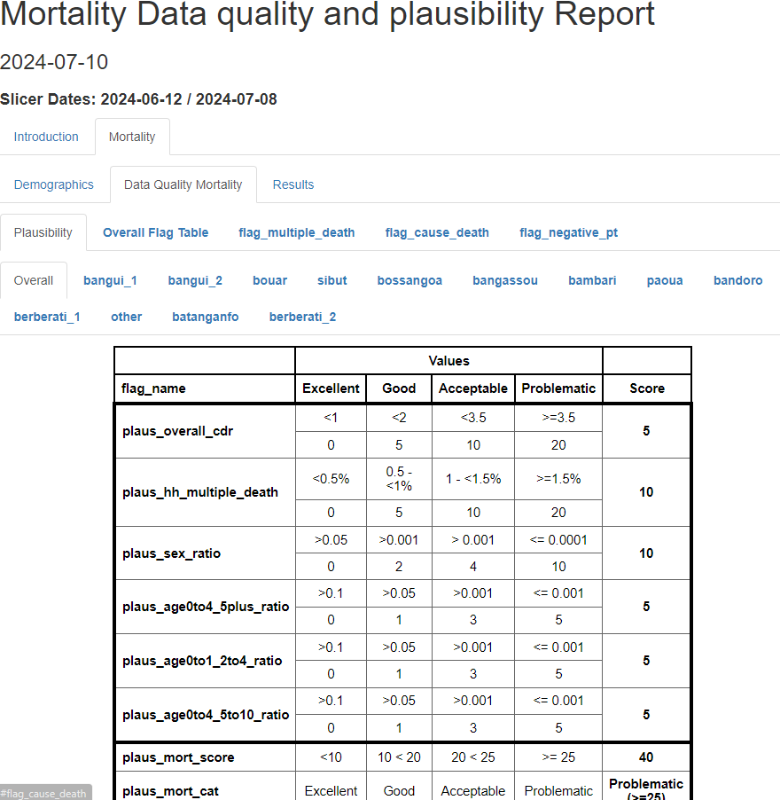
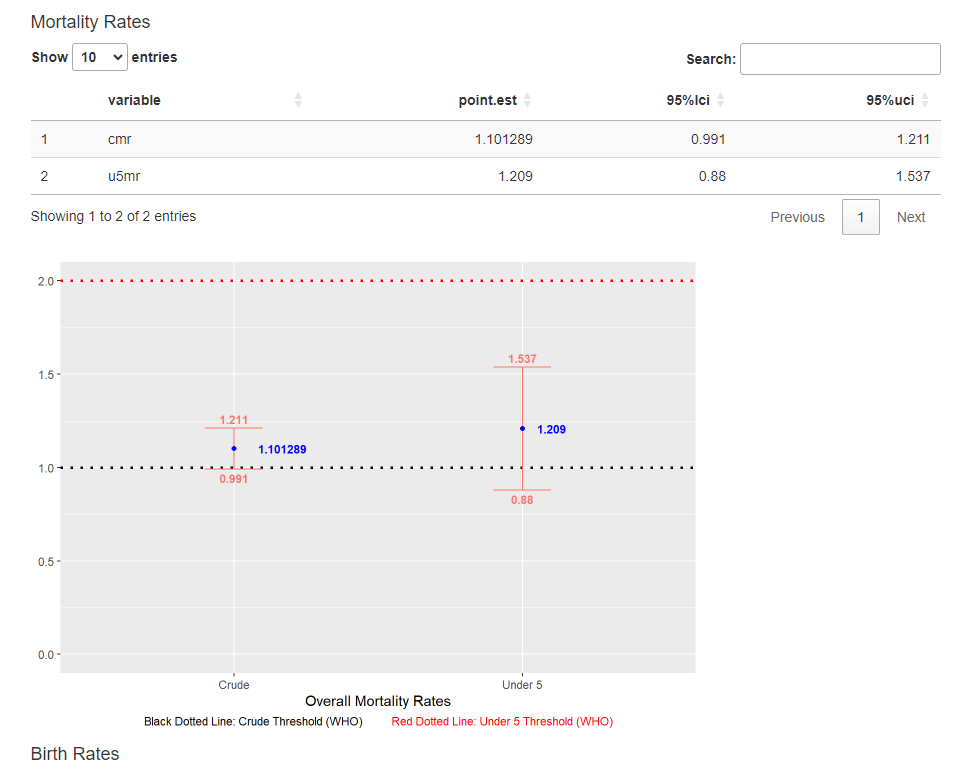

#### IYCF Section

After running all the line in the run_iycf_quality_report.R, below are
the set of inputs that are required for you to select/fill.
<strong>Please note that if the script is asking for a value that is not
in your data, then you should select cancel. However, make sure with the
respective focal point if these variables are required to get the
desired output.</strong>

<details>
<summary>
<h4>
Details
</h4>
</summary>

> `Raw Data` \<- Raw Data.<br> `Kobo Tool` \<- Kobo Tool.<br>
> `IYCF Indicators Sheet` \<- IYCF Indicators Individual level sheet
> from the raw data<br> `Main Sheet` \<- Main HH level sheet from the
> raw data<br> `Label column to choose` \<- Label you want to choose
> from the kobo tool.<br> `HH UUID column` \<- Household unique
> identifier in main sheet (usually \_uuid)<br>
> `Teams of Enumerator/Different Organizations` \<- Do you have teams of
> Enumerators or Different Organizations collecting data<br> If Yes<br>
> `Teams/Organization` \<- Teams of Enumerator/Organizations Column<br>
> `Enumerator` \<- Enumerator ID Column<br> `IYCF Sheet UUID column` \<-
> Household unique identifier in IYCF sheet (usually
> \_submission\_\_uuid)<br> `Age Month IYCF` \<- Age in months Column in
> the IYCF individual sheet (column with numbers between 0-11)<br>
> `Sex IYCF` \<- Sex/Gender Column in the IYCF individual sheet<br>
> `Male Option` \<- Male option (usually m/male/1)<br> `Female Option`
> \<- Female option (usually f/female/2)<br> `IYCF Caregiver` \<- Column
> indicating if caregiver is present (usually iycf_caregiver)<br>
> `IYCF Ever Breastfed` \<- Column indicating if child ever breastfed
> (usually iycf_1)<br> `IYCF Breastfeeding After Birth` \<- Column
> indicating how long the child started breastfeeding after birth
> (usually iycf_2)<br> `IYCF Exclusive Breastfeeding First 2 Days` \<-
> Column indicating Exclusive Breastfeeding First 2 Days (usually
> iycf_3)<br> `IYCF Breastfed Yesterday` \<- Column indicating the child
> was breastfed yesterday (usually iycf_4)<br>
> `IYCF Bottle Fed Yesterday` \<- Column indicating the child drink
> anything from a bottle yesterday (usually iycf_5)<br> `IYCF Water` \<-
> Column indicating liquid water (usually iycf_6a)<br>
> `IYCF Liquid Infant Formula` \<- Column indicating Liquid Infant
> Formula (usually iycf_6b)<br> `IYCF Milk from Animal` \<- Column
> indicating liquid milk from animal column (usually iycf_6c)<br>
> `IYCF Liquid Yogurt` \<- Column indicating liquid yogurt (usually
> iycf_6d)<br> `IYCF Chocolate Liquid` \<- Column indicating liquid
> chocolate flavoured drink (usually iycf_6e)<br> `IYCF Juice` \<-
> Column indicating liquid fruit juice or fruit flavored drink (usually
> iycf_6f)<br> `IYCF Soda` \<- Column indicating liquid
> sodas/malt/sports/energy drink (usually iycf_6g)<br> `IYCF Tea` \<-
> Column indicating liquid tea/coffee/herbal drink (usually iycf_6h)<br>
> `IYCF Broth` \<- Column indicating liquid clear broth/soup (usually
> iycf_6i)<br> `IYCF Other Liquids` \<- Column indicating other liquids
> (usually iycf_6j)<br> `IYCF Yogurt` \<- Column indicating yogurt as
> food (usually iycf_7a)<br> `IYCF Cereals` \<- Column indicating
> porridge/bread/rice/noodles/pasta (usually iycf_7b)<br>
> `IYCF Orange/Pumpkin` \<- Column indicating pumpkin/carrots/sweet red
> peppers/squash/sweet potato (usually iycf_7c)<br> `IYCF Roots` \<-
> Column indicating plantains/white potato/yams/manioc/cassava (usually
> iycf_7d)<br> `IYCF Green/Leafs` \<- Column indicating dark green leafy
> vegetables (usually iycf_7e)<br> `IYCF Other Vegs` \<- Column
> indicating other vegetables (usually iycf_7f)<br> `IYCF Fruits` \<-
> Column indicating ripe mangoes/ripe papayas (usually iycf_7g)<br>
> `IYCF Other Fruits` \<- Column indicating other Fruits (usually
> iycf_7h)<br> `IYCF Organs` \<- Column indicating liver/kidney/heart
> (usually iycf_7i)<br> `IYCF Meat` \<- Column indicating sausage/hot
> dogs/ham/bacon/salami/canned meat (usually iycf_7j)<br>
> `IYCF Other Meat` \<- Column indicating
> meat/beef/pork/lamb/goat/chicken/duck (usually iycf_7k)<br> `IYCF Egg`
> \<- Column indicating eggs (usually iycf_7l)<br> `IYCF Fish` \<-
> Column indicating fresh/dried/shell fish (usually iycf_7m)<br>
> `IYCF Legumes` \<- Column indicating beans/peas/lentils/nuts/seeds
> (usually iycf_7n)<br> `IYCF Cheese` \<- Column indicating hard/soft
> cheese (usually iycf_7o)<br> `IYCF Sweet` \<- Column indicating sweet
> foods (usually iycf_7p)<br> `IYCF Crisp/Fries` \<- Column indicating
> chips/crisps/puffs/french fries (usually iycf_7q)<br>
> `IYCF Other Foods` \<- Column indicating other foods (usually
> iycf_7r)<br> `IYCF Meal Frequency` \<- Column indicating meal
> frequency (usually iycf_8)<br> `IYCF Sweet Milk` \<- Column indicating
> sweet milk (usually iycf_6c_Swt)<br> `IYCF Sweet Yogurt Liquid` \<-
> Column indicating sweet yogurt liquid (usually iycf_6d_Swt)<br>
> `IYCF Sweet Tea` \<- Column indicating sweet tea (usually
> iycf_6h_Swt)<br> `IYCF Other Sweet Drink` \<- Column indicating other
> sweet drink (usually iycf_6j_Swt)<br> `Yes Answers` \<- Yes Values<br>
> `No Answers` \<- No Values<br> `Don't Know Answers` \<- Don’t Know
> Values<br> `Immediate Answer` \<- Immediately Value If Breastfeeding
> After Birth Answered<br> `Less Than A Day Answer` \<- Less Than A Day
> Value If Breastfeeding After Birth Answered<br>
> `More Than A Day Answer` \<- More Than A Day Value If Breastfeeding
> After Birth Answered<br> `Sex Ratio` \<- Male to Female Ratio in your
> respective area of study (usually 1/1)<br>
> `<6 months to 6-23 months Ratio` \<- \<6 months to 6-23 months Ratio
> in your respective area of study (usually 1/4)<br>
> `children are expected prevalence for Minimum Acceptable Diet (MAD) Decimal`
> \<- children are expected prevalence for Minimum Acceptable Diet (MAD)
> Decimal in your respective area of study (usually ~30%) \[Decimal
> between 0 - 1\]<br>

</details>
Here is an example of the output:
<ul>
<li>
Overall Plausibility Report / By Enumerator
</li>
<li>
All the flags related to IYCF (details shown for each flag in the
section)
</li>
<li>
Plots showing the distribution of the data.
</li>
</ul>

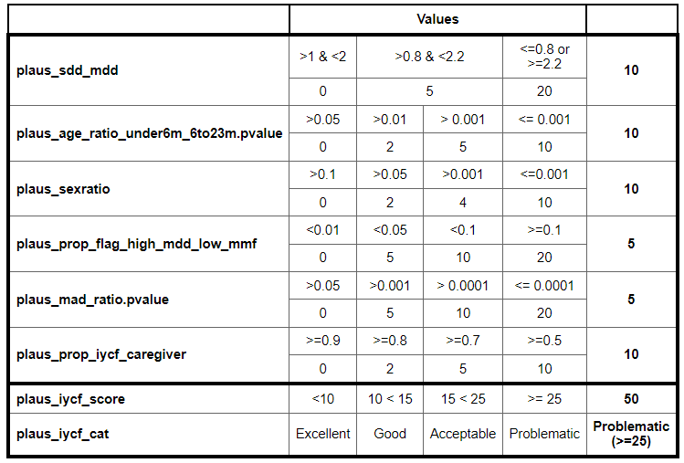

Here is an explanation of each of the plausibility line:


Here are examples of the flags to be checked (details of each flag is
explained in the cleaning section next):

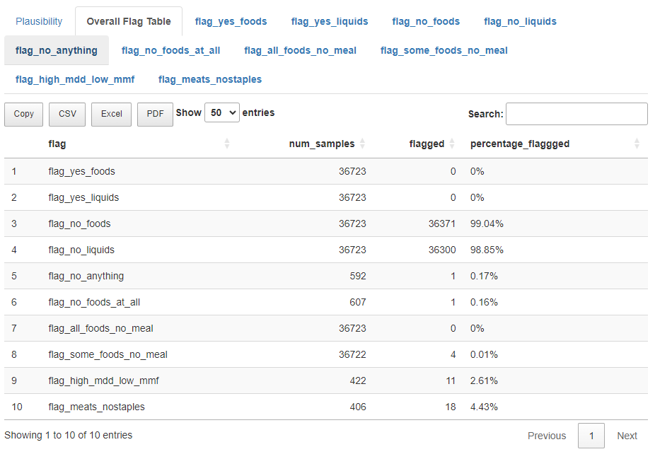

#### What to do next?

Please check each flag and the <strong>ACTION</strong> related to it and
act accordingly. Another output will be associated to this HTML, the
Excel file of the flags that were fired and requires follow-up with the
field team. Please check the README tab in the excel file. This file
will again be generated with the full data during the cleaning of the
dataset. So please do use this file during data collection and relate to
it in the final one to be filled.

### Cleaning

The Data Cleaning Template serves as a crucial tool for assessing the
data collection of all related public health indicators indicators
across different assessments. This comprehensive tool is designed to
identify and address potential issues within the data, ensuring that
field teams are being followed up on potential issues detected in the
data collection.

The report provides a detailed examination of the datasets, employing a
variety of metrics and methodologies to evaluate data quality. This
report aims to uncover any discrepancies, outliers, or anomalies that
may suggest data collection, entry errors, or underlying issues that
could impact the integrity of the findings.

#### Execution

Once the project is selected and saved as shown in the previous section,
automatically the respective file that you need to run will open. First
thing, you should select all the line codes in the file, and click run
as shown in the following picture.


The next step will requires you to answer/click/select/input some
information related to the sector that you are trying to check the
quality for. Generally this will include:
<ul>
<li>
Raw Data to check
</li>
<li>
Kobo Tool respective for the raw data
</li>
<li>
Inputs of specific columns/values that will be targeted within the
quality check.
</li>
</ul>

#### FSL Section

After running all the line in the run_fsl_cleaning.R, below are the set
of inputs that are required for you to select/fill. <strong>Please note
that if the script is asking for a value that is not in your data, then
you should select cancel. However, make sure with the respective focal
point if these variables are required to get the desired
output.</strong>

<details>
<summary>
<h4>
Details
</h4>
</summary>

> `Raw Data` \<- Raw Data.<br> `Kobo Tool` \<- Kobo Tool.<br>
> `FSL indicators sheet` \<- Sheet that includes all the FSL
> indicators.<br> `Label column to choose` \<- Label you want to choose
> from the kobo tool.<br> `FSL indicators` \<- FSL indicators you have
> collected in your data.<br> `HH UUID column` \<- Household unique
> identifier (usually uuid).<br> If FCS selected<br> `fsl_fcs_cereal`\<-
> Cereal Column related to Food Consumption Score <br>
> `fsl_fcs_legumes`\<- Legumes Column related to Food Consumption Score
> <br> `fsl_fcs_veg`\<- Vegetables Column related to Food Consumption
> Score <br> `fsl_fcs_fruit`\<- Fruit Column related to Food Consumption
> Score <br> `fsl_fcs_meat`\<- Meat Column related to Food Consumption
> Score <br> `fsl_fcs_dairy`\<- Dairy Column related to Food Consumption
> Score <br> `fsl_fcs_sugar`\<- Sugar Column related to Food Consumption
> Score <br> `fsl_fcs_oil`\<- Oil Column related to Food Consumption
> Score <br> If rCSI selected<br> `fsl_rcsi_lessquality` \<- rCSI Less
> Quality Food Column<br> `fsl_rcsi_borrow` \<- rCSI Borrowing Food
> Column<br> `fsl_rcsi_mealsize` \<- rCSI Reducing Meal Size Column<br>
> `fsl_rcsi_mealadult` \<- rCSI Reduce Meals For Adults and Prioritize
> Child Meals Column<br> `fsl_rcsi_mealnb` \<- rCSI Reduce Meal Numbers
> Column<br> If HHS selected<br> `fsl_hhs_nofoodhh` \<- HHS No Food in
> the Household Column<br> `fsl_hhs_nofoodhh_freq` \<- HHS Frequency No
> Food in the Household Column<br> `fsl_hhs_sleephungry` \<- HHS
> Sleeping Hungry Column<br> `fsl_hhs_sleephungry_freq` \<- HHS
> Frequency Sleeping Hungry Column<br> `fsl_hhs_alldaynight` \<- HHS All
> Day and Night Without Eating Column<br> `fsl_hhs_alldaynight_freq` \<-
> HHS All Day and Night Without Eating Column<br> `Yes Value` \<- HHS
> Yes value<br> `No Value` \<- HHS No value<br> `Rarely Value` \<- HHS
> Frequency Rarely value<br> `Sometimes Value` \<- HHS Frequency
> Sometimes value<br> `Often Value` \<- HHS Frequency Often value<br> If
> LCSI selected: 4 LCSI Stress, 3 LCSI Crisis, and 3 LCSI Emergency are
> required<br> `fsl_lcsi_stress1` \<- LCSI Stress 1 Column<br>
> `fsl_lcsi_stress2` \<- LCSI Stress 2 Column<br> `fsl_lcsi_stress3` \<-
> LCSI Stress 3 Column<br> `fsl_lcsi_stress4` \<- LCSI Stress 4
> Column<br> `fsl_lcsi_crisis1` \<- LCSI Crisis 1 Column<br>
> `fsl_lcsi_crisis1` \<- LCSI Crisis 1 Column<br> `fsl_lcsi_crisis2` \<-
> LCSI Crisis 2 Column<br> `fsl_lcsi_emergency2` \<- LCSI Emergency 2
> Column<br> `fsl_lcsi_emergency3` \<- LCSI Emergency 3 Column<br>
> `fsl_lcsi_emergency3` \<- LCSI Emergency 3 Column<br> `Yes Value` \<-
> LCSI Yes value<br> `No Value` \<- LCSI No had no need value<br>
> `Exhausted Value` \<- LCSI No exhausted value<br>
> `Not Applicable Value` \<- LCSI Not Applicable value<br> If HDDS
> selected<br> `fsl_hdds_cereals`\<- Cereals Column related to HDDS <br>
> `fsl_hdds_tubers`\<- Tubers Column related to HDDS <br>
> `fsl_hdds_veg`\<- Vegetables Column related to HDDS <br>
> `fsl_hdds_fruit`\<- Fruit Column related to HDDS <br>
> `fsl_hdds_meat`\<- Meat Column related to HDDS <br> `fsl_hdds_eggs`\<-
> Eggs Column related to HDDS <br> `fsl_hdds_fish`\<- Fish Column
> related to HDDS <br> `fsl_hdds_legumes`\<- Legumes Column related to
> HDDS <br> `fsl_hdds_dairy`\<- Dairy Column related to HDDS <br>
> `fsl_hdds_sugar`\<- Sugar Column related to HDDS <br>
> `fsl_hdds_oil`\<- Oil Column related to HDDS <br>
> `fsl_hdds_condiments`\<- Condiments Column related to HDDS <br>
> `Yes Value` \<- HDDS Yes value<br> `No Value` \<- HDDS No value<br>
> `Number of children` \<- Number of Children Under 5 Column<br>
> `Income Types` \<- Different Income Types (Only for Numerical Values
> and not Ratios)<br> `Residence Status` \<- Residence Status Column
> (IDP/HH/Refugee/etc.)<br> If Residence Status column exist<br>
> `IDP Value` \<- IDP value<br>
> `Teams of Enumerator/Different Organizations` \<- Do you have teams of
> Enumerators or Different Organizations collecting data<br> If Yes<br>
> `Teams/Organization` \<- Teams of Enumerator/Organizations Column<br>
> `Enumerator` \<- Enumerator ID Column<br>

</details>
The output includes:
<ul>
<li>
Excel file resembling a cleaning log to fill for flagged logical checks.
</li>
<li>
HTML file showing the flagged logical checks.
</li>
</ul>

<strong>For the full list of the logical checks, please check the
following
[link](https://acted.sharepoint.com/:x:/r/sites/IMPACT-Public_health/_layouts/15/Doc.aspx?sourcedoc=%7B22A07CAC-EBDE-45D7-97E8-2AAC9C8DE3E3%7D&file=2.%20FSL%20Checks%20and%20Flags%20Overview_2024Final_ENG.xlsx&action=default&mobileredirect=true)
in the FSL Sector Data Quality Section.</strong>

<strong>Direct Checks (logical checks that do not need follow up and are
directly included in the cleaning log):</strong>
<ul>
<li>
All FCS columns are 0. FCS Score is equal to 0. All values are changed
to NA.
</li>
<li>
All FCS columns are 7. All values are changed to NA.
</li>
<li>
All LCSI columns are not_applicable. All values are changed to NA.
</li>
<li>
The LCSI strategy related to Displacement/Migration but HH is not a
displaced group. Value of LCSI changed to NA.
</li>
<li>
The LCSI strategy related to Agriculture but HH do not have income type
related to agriculture. Value of LCSI changed to NA.
</li>
<li>
The LCSI strategy related to Livestock but HH do not have income type
related to livestock. Value of LCSI changed to NA.
</li>
</ul>
<strong>Follow-Up Checks (logical checks that requires follow-up and
cleaning if necessary):</strong>
<ul>
<li>
Check 1: rCSI Score is high while protein consumption is also reported
as frequent.
</li>
<li>
Check 2: HHs report using crisis or emergency strategies but not stress
strategies or Emergency and no crisis.
</li>
<li>
Check 3: HH that would have an acceptable FCS score and a high rCSI
score.
</li>
</ul>

#### Mortality Section (Individual Level)

After running all the line in the run_mort_cleaning.R, below are the set
of inputs that are required for you to select/fill. <strong>Please note
that if the script is asking for a value that is not in your data, then
you should select cancel. However, make sure with the respective focal
point if these variables are required to get the desired
output.</strong>

<details>
<summary>
<h4>
Details
</h4>
</summary>

> `Assessment Level` \<- Type of assessment: only HH level or Individual
> level collected. Make sure to select individual if dates of either
> leaver/joiners/birth/death were collected.<br> `Raw Data` \<- Raw
> Data.<br> `Kobo Tool` \<- Kobo Tool.<br> `Label column to choose` \<-
> Label you want to choose from the kobo tool.<br>
> `Information about leavers` \<- 1 for Yes/2 for No question if you
> collect extra information about leavers.<br> `Main Sheet` \<- Main HH
> level sheet from the raw data<br> `HH Roster Sheet` \<- Roster
> Individual level sheet from the raw data<br> `Died Members Sheet` \<-
> Died Members Individual level sheet from the raw data<br>
> `Left Members Sheet` \<- Left Members Individual level sheet from the
> raw data if Information was collected<br> `Date of Data Collection`
> \<- Date of Data collection column (usually “today”)<br>
> `Date of Recall Event` \<- Date of Recall Event column (usually
> “date_recall_event”)<br> `Teams of Enumerator/Different Organizations`
> \<- Do you have teams of Enumerators or Different Organizations
> collecting data<br> If Yes<br> `Teams/Organization` \<- Teams of
> Enumerator/Organizations Column<br> `Enumerator` \<- Enumerator ID
> Column<br> `Admin 1` \<- Admin 1 column<br> `Admin 2` \<- Admin 2
> column<br> `Cluster` \<- Cluster column<br> `HH UUID column` \<-
> Household unique identifier in main sheet (usually \_uuid)<br>
> `HH UUID Roster column` \<- Household unique identifier in roster
> individual sheet(usually \_submission\_\_uuid)<br> `Sex Roster` \<-
> Sex/Gender Column in the roster individual sheet<br> `Age Year Roster`
> \<- Age in years Column in the roster individual sheet (usually
> calc_final_age_years)<br> `Age Month Roster` \<- Age in months Column
> in the roster individual sheet(column with numbers between 0-11)<br>
> `Birth Roster` \<- Birth Column in the roster individual sheet with
> Yes/No answers if date of birth is known<br> `Birthdate Roster` \<-
> Birth Date Column in the roster individual sheet with final date of
> birth (Combination of estimated and exact)<br> `Joined Roster` \<-
> Joined Column in the roster individual sheet with Yes/No answers if
> date of joining is known<br> `Joineddate Roster` \<- Joined Date
> Column in the roster individual sheet with final date of joining
> (Combination of estimated and exact)<br> `HH UUID Left column` \<-
> Household unique identifier in leavers individual sheet(usually
> \_submission\_\_uuid). If Leavers details are collected.<br>
> `Sex Left Roster` \<- Sex/Gender Column in the leavers individual
> sheet<br> `Age Year Roster` \<- Age in years Column in the leavers
> individual sheet.<br> `Birth Left Roster` \<- Birth Column in the
> leavers individual sheet with Yes/No answers if date of birth is
> known<br> `Birthdate Left Roster` \<- Birth Date Column in the leavers
> individual sheet with final date of birth (Combination of estimated
> and exact)<br> `Joined Left Roster` \<- Joined Column in the leavers
> individual sheet with Yes/No answers if date of joining is known<br>
> `Joineddate Left Roster` \<- Joined Date Column in the leavers
> individual sheet with final date of joining (Combination of estimated
> and exact)<br> `Leftdate Left Roster` \<- Left Date Column in the
> leavers individual sheet with final date of leaving (Combination of
> estimated and exact)<br> `HH UUID Died column` \<- Household unique
> identifier in died members individual sheet(usually
> \_submission\_\_uuid)<br> `Sex Died Roster` \<- Sex/Gender Column in
> the died members individual sheet<br> `Age Year Died Roster` \<- Age
> in years Column in the died members individual sheet (usually
> calc_final_died_age_years)<br> `Birth Died Roster` \<- Birth Column in
> the died members individual sheet with Yes/No answers if date of birth
> is known<br> `Birthdate Died Roster` \<- Birth Date Column in the died
> members individual sheet with final date of birth (Combination of
> estimated and exact)<br> `Joined Died Roster` \<- Joined Column in the
> died members individual sheet with Yes/No answers if date of joining
> is known<br> `Joineddate Died Roster` \<- Joined Date Column in the
> died members individual sheet with final date of joining (Combination
> of estimated and exact)<br> `Deathdate Died Roster` \<- Death Date
> Column in the died members individual sheet with final date of death
> (Combination of estimated and exact)<br> `Death Cause` \<- Cause of
> Death column in died members individual sheet<br> `Death Location` \<-
> Location of Death column in died members individual sheet<br>
> `Do you have all the dates collected?[Left/Join/Birth/Death]` \<-
> Question if you collected all the dates of the respective sections<br>
> `Do you still collect num_join and num_left on HH level?` \<- If some
> selected, another question is asked to check if general number of
> joiners and leavers are collected on Household level<br>
> `Number of Leavers` \<- Number of leavers Column from the main sheet
> (usually num_left). Appears only if yes is selected in previous
> question.<br> `Number of Joiners` \<- Number of joiners Column from
> the main sheet (usually num_join). Appears only if yes is selected in
> previous question.<br> Filter/slicer for the start and end date
> quality report<br> `Start Date` \<- Start Date you wish to use<br>
> `End Date` \<- End Date you wish to use<br> `Male Option` \<- Male
> option (usually m/male/1)<br> `Female Option` \<- Female option
> (usually f/female/2)<br> `Format of Date of Data Collection` \<-
> Format of Date of Data Collection \[mdy,dmy,ymd,ydm,NA\] (“m” for
> month, “d” for day, “y” for year, NA for Date not collected<br>
> `Format of Date of Recall Event` \<- Format of Date of Recall Event
> \[mdy,dmy,ymd,ydm,NA\] (“m” for month, “d” for day, “y” for year, NA
> for Date not collected<br> `Format of Date of Joiners` \<- Format of
> Date of Joiners \[mdy,dmy,ymd,ydm,NA\] (“m” for month, “d” for day,
> “y” for year, NA for Date not collected<br>
> `Format of Date of Leavers` \<- Format of Date of Leavers
> \[mdy,dmy,ymd,ydm,NA\] (“m” for month, “d” for day, “y” for year, NA
> for Date not collected<br> `Format of Date of Birth` \<- Format of
> Date of Birth \[mdy,dmy,ymd,ydm,NA\] (“m” for month, “d” for day, “y”
> for year, NA for Date not collected<br> `Unknown Cause of Death` \<-
> Unknown options for the cause of death<br>
> `Injury/Trauma Cause of Death` \<- Injury/Trauma related options for
> the cause of death<br> `Illness Cause of Death` \<- Illness related
> options for the cause of death<br> `Current Location of Death` \<-
> Current options for the location of death<br>
> `During Migration Location of Death` \<- During migration options for
> the location of death<br> `Last Location of Death` \<- Last options
> for the location of death<br> `Other Location of Death` \<- Other
> options for the location of death<br> `Yes Values` \<- Yes/1
> Values<br> `No/NA Values` \<- No/0/NA Values<br>
> `Cause of Death related to Women` \<- Women related options for the
> cause of death<br> `Sex Ratio` \<- Male to Female Ratio in your
> respective area of study (usually 1/1)<br>
> `<5 years to >5 years Ratio` \<- \<5 years to \>5 years Ratio in your
> respective area of study (usually 1/4)<br>
> `<2 years of age of all children <5 years Ratio` \<- \<2 years of age
> of all children \<5 years Ratio in your respective area of study
> (usually ~41%)<br> `<5 years of age out of under-10 children Ratio`
> \<- \<5 years of age out of under-10 children Ratio in your respective
> area of study (usually ~52%)<br> `HH average size` \<- HH average size
> in your respective area of study (usually 5)<br>

</details>
The output includes:
<ul>
<li>
Excel file resembling a cleaning log to fill for flagged logical checks.
</li>
<li>
HTML file showing the flagged logical checks.
</li>
</ul>
<strong>Follow-Up Checks:</strong>
<ul>
<li>
Check 1: Respondent reported more than 2 death in the HH.
</li>
<li>
Check 2: Respondent reported sex of dead person male and a cause of
death related to female only.
</li>
<li>
Check 3: Respondent reported wrong dates leading to a negative person
time.
</li>
</ul>

#### Mortality Section (Household Level)

<strong>Follow-Up Checks</strong>
<ul>
<li>
Check 1: Respondent reported more than 2 death in the HH.
</li>
</ul>

#### IYCF Section

After running all the line in the run_iycf_cleaning.R, below are the set
of inputs that are required for you to select/fill. <strong>Please note
that if the script is asking for a value that is not in your data, then
you should select cancel. However, make sure with the respective focal
point if these variables are required to get the desired
output.</strong>

<details>
<summary>
<h4>
Details
</h4>
</summary>

> `Raw Data` \<- Raw Data.<br> `Kobo Tool` \<- Kobo Tool.<br>
> `IYCF Indicators Sheet` \<- IYCF Indicators Individual level sheet
> from the raw data<br> `Main Sheet` \<- Main HH level sheet from the
> raw data<br> `Label column to choose` \<- Label you want to choose
> from the kobo tool.<br> `HH UUID column` \<- Household unique
> identifier in main sheet (usually \_uuid)<br>
> `Teams of Enumerator/Different Organizations` \<- Do you have teams of
> Enumerators or Different Organizations collecting data<br> If Yes<br>
> `Teams/Organization` \<- Teams of Enumerator/Organizations Column<br>
> `Enumerator` \<- Enumerator ID Column<br> `IYCF Sheet UUID column` \<-
> Household unique identifier in IYCF sheet (usually
> \_submission\_\_uuid)<br> `Age Month IYCF` \<- Age in months Column in
> the IYCF individual sheet (column with numbers between 0-11)<br>
> `Sex IYCF` \<- Sex/Gender Column in the IYCF individual sheet<br>
> `Male Option` \<- Male option (usually m/male/1)<br> `Female Option`
> \<- Female option (usually f/female/2)<br> `IYCF Caregiver` \<- Column
> indicating if caregiver is present (usually iycf_caregiver)<br>
> `IYCF Ever Breastfed` \<- Column indicating if child ever breastfed
> (usually iycf_1)<br> `IYCF Breastfeeding After Birth` \<- Column
> indicating how long the child started breastfeeding after birth
> (usually iycf_2)<br> `IYCF Exclusive Breastfeeding First 2 Days` \<-
> Column indicating Exclusive Breastfeeding First 2 Days (usually
> iycf_3)<br> `IYCF Breastfed Yesterday` \<- Column indicating the child
> was breastfed yesterday (usually iycf_4)<br>
> `IYCF Bottle Fed Yesterday` \<- Column indicating the child drink
> anything from a bottle yesterday (usually iycf_5)<br> `IYCF Water` \<-
> Column indicating liquid water (usually iycf_6a)<br>
> `IYCF Liquid Infant Formula` \<- Column indicating Liquid Infant
> Formula (usually iycf_6b)<br> `IYCF Milk from Animal` \<- Column
> indicating liquid milk from animal column (usually iycf_6c)<br>
> `IYCF Liquid Yogurt` \<- Column indicating liquid yogurt (usually
> iycf_6d)<br> `IYCF Chocolate Liquid` \<- Column indicating liquid
> chocolate flavoured drink (usually iycf_6e)<br> `IYCF Juice` \<-
> Column indicating liquid fruit juice or fruit flavored drink (usually
> iycf_6f)<br> `IYCF Soda` \<- Column indicating liquid
> sodas/malt/sports/energy drink (usually iycf_6g)<br> `IYCF Tea` \<-
> Column indicating liquid tea/coffee/herbal drink (usually iycf_6h)<br>
> `IYCF Broth` \<- Column indicating liquid clear broth/soup (usually
> iycf_6i)<br> `IYCF Other Liquids` \<- Column indicating other liquids
> (usually iycf_6j)<br> `IYCF Yogurt` \<- Column indicating yogurt as
> food (usually iycf_7a)<br> `IYCF Cereals` \<- Column indicating
> porridge/bread/rice/noodles/pasta (usually iycf_7b)<br>
> `IYCF Orange/Pumpkin` \<- Column indicating pumpkin/carrots/sweet red
> peppers/squash/sweet potato (usually iycf_7c)<br> `IYCF Roots` \<-
> Column indicating plantains/white potato/yams/manioc/cassava (usually
> iycf_7d)<br> `IYCF Green/Leafs` \<- Column indicating dark green leafy
> vegetables (usually iycf_7e)<br> `IYCF Other Vegs` \<- Column
> indicating other vegetables (usually iycf_7f)<br> `IYCF Fruits` \<-
> Column indicating ripe mangoes/ripe papayas (usually iycf_7g)<br>
> `IYCF Other Fruits` \<- Column indicating other Fruits (usually
> iycf_7h)<br> `IYCF Organs` \<- Column indicating liver/kidney/heart
> (usually iycf_7i)<br> `IYCF Meat` \<- Column indicating sausage/hot
> dogs/ham/bacon/salami/canned meat (usually iycf_7j)<br>
> `IYCF Other Meat` \<- Column indicating
> meat/beef/pork/lamb/goat/chicken/duck (usually iycf_7k)<br> `IYCF Egg`
> \<- Column indicating eggs (usually iycf_7l)<br> `IYCF Fish` \<-
> Column indicating fresh/dried/shell fish (usually iycf_7m)<br>
> `IYCF Legumes` \<- Column indicating beans/peas/lentils/nuts/seeds
> (usually iycf_7n)<br> `IYCF Cheese` \<- Column indicating hard/soft
> cheese (usually iycf_7o)<br> `IYCF Sweet` \<- Column indicating sweet
> foods (usually iycf_7p)<br> `IYCF Crisp/Fries` \<- Column indicating
> chips/crisps/puffs/french fries (usually iycf_7q)<br>
> `IYCF Other Foods` \<- Column indicating other foods (usually
> iycf_7r)<br> `IYCF Meal Frequency` \<- Column indicating meal
> frequency (usually iycf_8)<br> `IYCF Sweet Milk` \<- Column indicating
> sweet milk (usually iycf_6c_Swt)<br> `IYCF Sweet Yogurt Liquid` \<-
> Column indicating sweet yogurt liquid (usually iycf_6d_Swt)<br>
> `IYCF Sweet Tea` \<- Column indicating sweet tea (usually
> iycf_6h_Swt)<br> `IYCF Other Sweet Drink` \<- Column indicating other
> sweet drink (usually iycf_6j_Swt)<br> `Yes Answers` \<- Yes Values<br>
> `No Answers` \<- No Values<br> `Don't Know Answers` \<- Don’t Know
> Values<br> `Immediate Answer` \<- Immediately Value If Breastfeeding
> After Birth Answered<br> `Less Than A Day Answer` \<- Less Than A Day
> Value If Breastfeeding After Birth Answered<br>
> `More Than A Day Answer` \<- More Than A Day Value If Breastfeeding
> After Birth Answered<br> `Sex Ratio` \<- Male to Female Ratio in your
> respective area of study (usually 1/1)<br>
> `<6 months to 6-23 months Ratio` \<- \<6 months to 6-23 months Ratio
> in your respective area of study (usually 1/4)<br>
> `children are expected prevalence for Minimum Acceptable Diet (MAD) Decimal`
> \<- children are expected prevalence for Minimum Acceptable Diet (MAD)
> Decimal in your respective area of study (usually ~30%) \[Decimal
> between 0 - 1\]<br>

</details>
The output includes:
<ul>
<li>
Excel file resembling a cleaning log to fill for flagged logical checks.
</li>
<li>
HTML file showing the flagged logical checks.
</li>
</ul>
<strong>Follow-Up Checks:</strong>
<ul>
<li>
Check 1:Number of detected entries with Respondent reported child
consuming all foods groups
</li>
<li>
Check 2:Number of detected entries with Respondent reported child
consuming all liquids groups
</li>
<li>
Check 3:Number of detected entries with Respondent reported child
consuming no foods or liquids groups at all
</li>
<li>
Check 4:Number of detected entries with Respondent reported child
consuming no foods groups while reporting eating solid or semi-solid
food meals
</li>
<li>
Check 5:Number of detected entries with Respondent reported child
consuming all foods groups while reporting not eating any solid or
semi-solid food meals
</li>
<li>
Check 6:Number of detected entries with Respondent reported child
consuming some foods groups while reporting not eating any solid or
semi-solid food meals
</li>
<li>
Check 7:Number of detected entries with Respondent reported high mdd
score while reporting low meal frequency consumed (\<=1)
</li>
<li>
Check 8:Number of detected entries with Respondent reported child under
6 month and not breastfed and no milk given
</li>
<li>
Check 9:Number of detected entries with Respondent reported child
consuming meats but no staples
</li>
</ul>

#### What to do next?

Please check the files in the output/ folder. The cleaning_logbook.xlsx
already can contain some of the directly cleaned data. The
followup_request.xlsm file represent the checks that needs to be
followed up with the field team. Please follow the instruction in the
READ_ME tab to know how to fill the file. After filling the file, you
can merge the \[uuid/variable/old.value/new.value/issue\] from the
filled file with the cleaning_logbook.xlsx and add them to your cleaning
scripts.

### Descriptive Analysis

The Descriptive Analysis is an analytical platform that presents a
multitude of quantitative data tables. It encompasses a wide range of
public health indicators collected through the assessment process,
empowering users to examine and interpret complex datasets effectively.
This tool is structured to support understanding the distribution of
your data and support you writing your factsheets/outputs/reports, and
create other visualizations.

#### FSL Section

After running all the line in the run_fsl_descriptive_analysis.R, below
are the set of inputs that are required for you to select/fill.
<strong>Please note that if the script is asking for a value that is not
in your data, then you should select cancel. However, make sure with the
respective focal point if these variables are required to get the
desired output.</strong>

<details>
<summary>
<h4>
Details
</h4>
</summary>

> `Raw Data` \<- Raw Data.<br> `Kobo Tool` \<- Kobo Tool.<br>
> `FSL indicators sheet` \<- Sheet that includes all the FSL
> indicators.<br> `Label column to choose` \<- Label you want to choose
> from the kobo tool.<br> `FSL indicators` \<- FSL indicators you have
> collected in your data.<br> `FSL variables` \<- Exstra variables
> related to FSL you wish to analyse<br> `HH UUID column` \<- Household
> unique identifier (usually uuid).<br> If FCS selected<br>
> `fsl_fcs_cereal`\<- Cereal Column related to Food Consumption Score
> <br> `fsl_fcs_legumes`\<- Legumes Column related to Food Consumption
> Score <br> `fsl_fcs_veg`\<- Vegetables Column related to Food
> Consumption Score <br> `fsl_fcs_fruit`\<- Fruit Column related to Food
> Consumption Score <br> `fsl_fcs_meat`\<- Meat Column related to Food
> Consumption Score <br> `fsl_fcs_dairy`\<- Dairy Column related to Food
> Consumption Score <br> `fsl_fcs_sugar`\<- Sugar Column related to Food
> Consumption Score <br> `fsl_fcs_oil`\<- Oil Column related to Food
> Consumption Score <br> If rCSI selected<br> `fsl_rcsi_lessquality` \<-
> rCSI Less Quality Food Column<br> `fsl_rcsi_borrow` \<- rCSI Borrowing
> Food Column<br> `fsl_rcsi_mealsize` \<- rCSI Reducing Meal Size
> Column<br> `fsl_rcsi_mealadult` \<- rCSI Reduce Meals For Adults and
> Prioritize Child Meals Column<br> `fsl_rcsi_mealnb` \<- rCSI Reduce
> Meal Numbers Column<br> If HHS selected<br> `fsl_hhs_nofoodhh` \<- HHS
> No Food in the Household Column<br> `fsl_hhs_nofoodhh_freq` \<- HHS
> Frequency No Food in the Household Column<br> `fsl_hhs_sleephungry`
> \<- HHS Sleeping Hungry Column<br> `fsl_hhs_sleephungry_freq` \<- HHS
> Frequency Sleeping Hungry Column<br> `fsl_hhs_alldaynight` \<- HHS All
> Day and Night Without Eating Column<br> `fsl_hhs_alldaynight_freq` \<-
> HHS All Day and Night Without Eating Column<br> `Yes Value` \<- HHS
> Yes value<br> `No Value` \<- HHS No value<br> `Rarely Value` \<- HHS
> Frequency Rarely value<br> `Sometimes Value` \<- HHS Frequency
> Sometimes value<br> `Often Value` \<- HHS Frequency Often value<br> If
> LCSI selected: 4 LCSI Stress, 3 LCSI Crisis, and 3 LCSI Emergency are
> required<br> `fsl_lcsi_stress1` \<- LCSI Stress 1 Column<br>
> `fsl_lcsi_stress2` \<- LCSI Stress 2 Column<br> `fsl_lcsi_stress3` \<-
> LCSI Stress 3 Column<br> `fsl_lcsi_stress4` \<- LCSI Stress 4
> Column<br> `fsl_lcsi_crisis1` \<- LCSI Crisis 1 Column<br>
> `fsl_lcsi_crisis1` \<- LCSI Crisis 1 Column<br> `fsl_lcsi_crisis2` \<-
> LCSI Crisis 2 Column<br> `fsl_lcsi_emergency2` \<- LCSI Emergency 2
> Column<br> `fsl_lcsi_emergency3` \<- LCSI Emergency 3 Column<br>
> `fsl_lcsi_emergency3` \<- LCSI Emergency 3 Column<br> `Yes Value` \<-
> LCSI Yes value<br> `No Value` \<- LCSI No had no need value<br>
> `Exhausted Value` \<- LCSI No exhausted value<br>
> `Not Applicable Value` \<- LCSI Not Applicable value<br> If HDDS
> selected<br> `fsl_hdds_cereals`\<- Cereals Column related to HDDS <br>
> `fsl_hdds_tubers`\<- Tubers Column related to HDDS <br>
> `fsl_hdds_veg`\<- Vegetables Column related to HDDS <br>
> `fsl_hdds_fruit`\<- Fruit Column related to HDDS <br>
> `fsl_hdds_meat`\<- Meat Column related to HDDS <br> `fsl_hdds_eggs`\<-
> Eggs Column related to HDDS <br> `fsl_hdds_fish`\<- Fish Column
> related to HDDS <br> `fsl_hdds_legumes`\<- Legumes Column related to
> HDDS <br> `fsl_hdds_dairy`\<- Dairy Column related to HDDS <br>
> `fsl_hdds_sugar`\<- Sugar Column related to HDDS <br>
> `fsl_hdds_oil`\<- Oil Column related to HDDS <br>
> `fsl_hdds_condiments`\<- Condiments Column related to HDDS <br>
> `Yes Value` \<- HDDS Yes value<br> `No Value` \<- HDDS No value<br>
> `Number of children` \<- Number of Children Under 5 Column<br>
> `Income Types` \<- Different Income Types (Only for Numerical Values
> and not Ratios)<br> `Residence Status` \<- Residence Status Column
> (IDP/HH/Refugee/etc.)<br> If Residence Status column exist<br>
> `IDP Value` \<- IDP value<br>
> `Teams of Enumerator/Different Organizations` \<- Do you have teams of
> Enumerators or Different Organizations collecting data<br> If Yes<br>
> `Teams/Organization` \<- Teams of Enumerator/Organizations Column<br>
> `Enumerator` \<- Enumerator ID Column<br> `Is your data weighted` \<-
> Question to check if your data is weighted (Yes/No).<br> `Weight` \<-
> If yes, select the weight column in your data. <br>

</details>
As you saw in the output folder, you will have another excel file
outputted from the analysis script.
<ul>
<li>
HTML file including all the extra selected variables for analysis, as
well as the main FSL outcome indicators overalls.
</li>
<li>
The Excel file includes 2 sheets. The first 2 are all the tables that
you will see in the HTML output. You can navigate to respective tables
through the first sheet “Table of Contents”.
</li>
<li>
<strong>Another output as well is an excel file that includes all the
FSL outcome indicators formatted for the IPC AFI analysis to be used for
submission of MSNA data to the IPC AFI.</strong>
</li>
</ul>


#### Mortality Section

After running all the line in the run_mort_descriptive_analysis.R, below
are the set of inputs that are required for you to select/fill.
<strong>Please note that if the script is asking for a value that is not
in your data, then you should select cancel. However, make sure with the
respective focal point if these variables are required to get the
desired output.</strong>

<details>
<summary>
<h4>
Details
</h4>
</summary>

> `Raw Data` \<- Raw Data.<br> `Kobo Tool` \<- Kobo Tool.<br>
> `Select Multiple Separator` \<- This is the separator used in the data
> for the select_multiple questions<br> `Assessment Level` \<- Type of
> assessment: only HH level or Individual level collected. Make sure to
> select individual if dates of either leaver/joiners/birth/death were
> collected.<br> `Mortality variables` \<- Extra variables related to
> mortality you wish to analyse<br> `Label column to choose` \<- Label
> you want to choose from the kobo tool<br> `Information about leavers`
> \<- 1 for Yes/2 for No question if you collect extra information about
> leavers<br> `Main Sheet` \<- Main HH level sheet from the raw data<br>
> `HH Roster Sheet` \<- Roster Individual level sheet from the raw
> data<br> `Died Members Sheet` \<- Died Members Individual level sheet
> from the raw data<br> `Left Members Sheet` \<- Left Members Individual
> level sheet from the raw data if Information was collected<br>
> `Date of Data Collection` \<- Date of Data collection column (usually
> “today”)<br> `Date of Recall Event` \<- Date of Recall Event column
> (usually “date_recall_event”)<br>
> `Teams of Enumerator/Different Organizations` \<- Do you have teams of
> Enumerators or Different Organizations collecting data<br> If Yes<br>
> `Teams/Organization` \<- Teams of Enumerator/Organizations Column<br>
> `Enumerator` \<- Enumerator ID Column<br> `Admin 1` \<- Admin 1
> column<br> `Admin 2` \<- Admin 2 column<br> `Cluster` \<- Cluster
> column<br> `HH UUID column` \<- Household unique identifier in main
> sheet (usually \_uuid)<br> `Population Group` \<- Population Group
> Status Column (IDP/Refugee/Host/etc.)<br> `Income Sources` \<-
> Different Income Sources (Only for Numerical Values and not
> Ratios)<br> `More than one column for Head of Household Gender` \<-
> Question to check if tool collect more than one column to define Head
> of Household Gender<br> `Respondent Gender` \<- Respondent Gender
> Column (IF yes)<br> `Head of Household column` \<- Column defining if
> respondent is head of household (Yes/No)<br>
> `Head of Household Gender column` \<- Column defining Gender of Head
> of Household<br> `HH UUID Roster column` \<- Household unique
> identifier in roster individual sheet(usually
> \_submission\_\_uuid)<br> `Sex Roster` \<- Sex/Gender Column in the
> roster individual sheet<br> `Age Year Roster` \<- Age in years Column
> in the roster individual sheet (usually calc_final_age_years)<br>
> `Age Month Roster` \<- Age in months Column in the roster individual
> sheet(column with numbers between 0-11)<br> `Birth Roster` \<- Birth
> Column in the roster individual sheet with Yes/No answers if date of
> birth is known<br> `Birthdate Roster` \<- Birth Date Column in the
> roster individual sheet with final date of birth (Combination of
> estimated and exact)<br> `Joined Roster` \<- Joined Column in the
> roster individual sheet with Yes/No answers if date of joining is
> known<br> `Joineddate Roster` \<- Joined Date Column in the roster
> individual sheet with final date of joining (Combination of estimated
> and exact)<br> `HH UUID Left column` \<- Household unique identifier
> in leavers individual sheet(usually \_submission\_\_uuid). If Leavers
> details are collected.<br> `Sex Left Roster` \<- Sex/Gender Column in
> the leavers individual sheet<br> `Age Year Roster` \<- Age in years
> Column in the leavers individual sheet.<br> `Birth Left Roster` \<-
> Birth Column in the leavers individual sheet with Yes/No answers if
> date of birth is known<br> `Birthdate Left Roster` \<- Birth Date
> Column in the leavers individual sheet with final date of birth
> (Combination of estimated and exact)<br> `Joined Left Roster` \<-
> Joined Column in the leavers individual sheet with Yes/No answers if
> date of joining is known<br> `Joineddate Left Roster` \<- Joined Date
> Column in the leavers individual sheet with final date of joining
> (Combination of estimated and exact)<br> `Leftdate Left Roster` \<-
> Left Date Column in the leavers individual sheet with final date of
> leaving (Combination of estimated and exact)<br> `HH UUID Died column`
> \<- Household unique identifier in died members individual
> sheet(usually \_submission\_\_uuid)<br> `Sex Died Roster` \<-
> Sex/Gender Column in the died members individual sheet<br>
> `Age Year Died Roster` \<- Age in years Column in the died members
> individual sheet (usually calc_final_died_age_years)<br>
> `Birth Died Roster` \<- Birth Column in the died members individual
> sheet with Yes/No answers if date of birth is known<br>
> `Birthdate Died Roster` \<- Birth Date Column in the died members
> individual sheet with final date of birth (Combination of estimated
> and exact)<br> `Joined Died Roster` \<- Joined Column in the died
> members individual sheet with Yes/No answers if date of joining is
> known<br> `Joineddate Died Roster` \<- Joined Date Column in the died
> members individual sheet with final date of joining (Combination of
> estimated and exact)<br> `Deathdate Died Roster` \<- Death Date Column
> in the died members individual sheet with final date of death
> (Combination of estimated and exact)<br> `Death Cause` \<- Cause of
> Death column in died members individual sheet<br> `Death Location` \<-
> Location of Death column in died members individual sheet<br>
> `Do you have all the dates collected?[Left/Join/Birth/Death]` \<-
> Question if you collected all the dates of the respective sections<br>
> `Do you still collect num_join and num_left on HH level?` \<- If some
> selected, another question is asked to check if general number of
> joiners and leavers are collected on Household level<br>
> `Number of Leavers` \<- Number of leavers Column from the main sheet
> (usually num_left). Appears only if yes is selected in previous
> question.<br> `Number of Joiners` \<- Number of joiners Column from
> the main sheet (usually num_join). Appears only if yes is selected in
> previous question.<br> Filter/slicer for the start and end date
> quality report<br> `Start Date` \<- Start Date you wish to use<br>
> `End Date` \<- End Date you wish to use<br> `Male Option` \<- Male
> option (usually m/male/1)<br> `Female Option` \<- Female option
> (usually f/female/2)<br> `Format of Date of Data Collection` \<-
> Format of Date of Data Collection \[mdy,dmy,ymd,ydm,NA\] (“m” for
> month, “d” for day, “y” for year, NA for Date not collected<br>
> `Format of Date of Recall Event` \<- Format of Date of Recall Event
> \[mdy,dmy,ymd,ydm,NA\] (“m” for month, “d” for day, “y” for year, NA
> for Date not collected<br> `Format of Date of Joiners` \<- Format of
> Date of Joiners \[mdy,dmy,ymd,ydm,NA\] (“m” for month, “d” for day,
> “y” for year, NA for Date not collected<br>
> `Format of Date of Leavers` \<- Format of Date of Leavers
> \[mdy,dmy,ymd,ydm,NA\] (“m” for month, “d” for day, “y” for year, NA
> for Date not collected<br> `Format of Date of Birth` \<- Format of
> Date of Birth \[mdy,dmy,ymd,ydm,NA\] (“m” for month, “d” for day, “y”
> for year, NA for Date not collected<br> `Unknown Cause of Death` \<-
> Unknown options for the cause of death<br>
> `Injury/Trauma Cause of Death` \<- Injury/Trauma related options for
> the cause of death<br> `Illness Cause of Death` \<- Illness related
> options for the cause of death<br> `Current Location of Death` \<-
> Current options for the location of death<br>
> `During Migration Location of Death` \<- During migration options for
> the location of death<br> `Last Location of Death` \<- Last options
> for the location of death<br> `Other Location of Death` \<- Other
> options for the location of death<br> `Yes Values` \<- Yes/1
> Values<br> `No/NA Values` \<- No/0/NA Values<br>
> `Cause of Death related to Women` \<- Women related options for the
> cause of death<br> `Sex Ratio` \<- Male to Female Ratio in your
> respective area of study (usually 1/1)<br>
> `<5 years to >5 years Ratio` \<- \<5 years to \>5 years Ratio in your
> respective area of study (usually 1/4)<br>
> `<2 years of age of all children <5 years Ratio` \<- \<2 years of age
> of all children \<5 years Ratio in your respective area of study
> (usually ~41%)<br> `<5 years of age out of under-10 children Ratio`
> \<- \<5 years of age out of under-10 children Ratio in your respective
> area of study (usually ~52%)<br> `HH average size` \<- HH average size
> in your respective area of study (usually 5)<br>
> `Is your data weighted` \<- Question to check if your data is weighted
> (Yes/No).<br> `Weight` \<- If yes, select the weight column in your
> data.<br> `Died Healthcare` \<- Did the died person seek healthcare
> (Yes/No)<br>

</details>
As you saw in the output folder, you will have another excel file
outputted from the analysis script.
<ul>
<li>
HTML file including all the extra selected variables for analysis, as
well as plots and rates or mortality and birth disaggregated on
different levels as shown in the screenshot below.
</li>
<li>
The Excel file includes many sheets. The first 2 are all the tables that
you see in the first part of the HTML output. You can navigate to
respective tables through the first sheet “Table of Contents”. The other
sheets are teh different disaggregated tables.
</li>
<li>
PH integrated table excel file that is used as input for the Integrated
PH Tables project.
</li>
</ul>

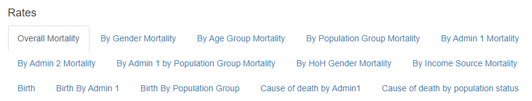

#### IYCF

After running all the line in the run_iycf_descriptive_analysis.R, below
are the set of inputs that are required for you to select/fill.
<strong>Please note that if the script is asking for a value that is not
in your data, then you should select cancel. However, make sure with the
respective focal point if these variables are required to get the
desired output.</strong>

<details>
<summary>
<h4>
Details
</h4>
</summary>

> `Raw Data` \<- Raw Data.<br> `Kobo Tool` \<- Kobo Tool.<br>
> `IYCF variables` \<- Exstra variables related to IYCF you wish to
> analyse<br> `IYCF Indicators Sheet` \<- IYCF Indicators Individual
> level sheet from the raw data<br> `Main Sheet` \<- Main HH level sheet
> from the raw data<br> `Label column to choose` \<- Label you want to
> choose from the kobo tool.<br> `HH UUID column` \<- Household unique
> identifier in main sheet (usually \_uuid)<br>
> `Teams of Enumerator/Different Organizations` \<- Do you have teams of
> Enumerators or Different Organizations collecting data<br> If Yes<br>
> `Teams/Organization` \<- Teams of Enumerator/Organizations Column<br>
> `Enumerator` \<- Enumerator ID Column<br> `IYCF Sheet UUID column` \<-
> Household unique identifier in IYCF sheet (usually
> \_submission\_\_uuid)<br> `Age Month IYCF` \<- Age in months Column in
> the IYCF individual sheet (column with numbers between 0-11)<br>
> `Sex IYCF` \<- Sex/Gender Column in the IYCF individual sheet<br>
> `Male Option` \<- Male option (usually m/male/1)<br> `Female Option`
> \<- Female option (usually f/female/2)<br> `IYCF Caregiver` \<- Column
> indicating if caregiver is present (usually iycf_caregiver)<br>
> `IYCF Ever Breastfed` \<- Column indicating if child ever breastfed
> (usually iycf_1)<br> `IYCF Breastfeeding After Birth` \<- Column
> indicating how long the child started breastfeeding after birth
> (usually iycf_2)<br> `IYCF Exclusive Breastfeeding First 2 Days` \<-
> Column indicating Exclusive Breastfeeding First 2 Days (usually
> iycf_3)<br> `IYCF Breastfed Yesterday` \<- Column indicating the child
> was breastfed yesterday (usually iycf_4)<br>
> `IYCF Bottle Fed Yesterday` \<- Column indicating the child drink
> anything from a bottle yesterday (usually iycf_5)<br> `IYCF Water` \<-
> Column indicating liquid water (usually iycf_6a)<br>
> `IYCF Liquid Infant Formula` \<- Column indicating Liquid Infant
> Formula (usually iycf_6b)<br> `IYCF Milk from Animal` \<- Column
> indicating liquid milk from animal column (usually iycf_6c)<br>
> `IYCF Liquid Yogurt` \<- Column indicating liquid yogurt (usually
> iycf_6d)<br> `IYCF Chocolate Liquid` \<- Column indicating liquid
> chocolate flavoured drink (usually iycf_6e)<br> `IYCF Juice` \<-
> Column indicating liquid fruit juice or fruit flavored drink (usually
> iycf_6f)<br> `IYCF Soda` \<- Column indicating liquid
> sodas/malt/sports/energy drink (usually iycf_6g)<br> `IYCF Tea` \<-
> Column indicating liquid tea/coffee/herbal drink (usually iycf_6h)<br>
> `IYCF Broth` \<- Column indicating liquid clear broth/soup (usually
> iycf_6i)<br> `IYCF Other Liquids` \<- Column indicating other liquids
> (usually iycf_6j)<br> `IYCF Yogurt` \<- Column indicating yogurt as
> food (usually iycf_7a)<br> `IYCF Cereals` \<- Column indicating
> porridge/bread/rice/noodles/pasta (usually iycf_7b)<br>
> `IYCF Orange/Pumpkin` \<- Column indicating pumpkin/carrots/sweet red
> peppers/squash/sweet potato (usually iycf_7c)<br> `IYCF Roots` \<-
> Column indicating plantains/white potato/yams/manioc/cassava (usually
> iycf_7d)<br> `IYCF Green/Leafs` \<- Column indicating dark green leafy
> vegetables (usually iycf_7e)<br> `IYCF Other Vegs` \<- Column
> indicating other vegetables (usually iycf_7f)<br> `IYCF Fruits` \<-
> Column indicating ripe mangoes/ripe papayas (usually iycf_7g)<br>
> `IYCF Other Fruits` \<- Column indicating other Fruits (usually
> iycf_7h)<br> `IYCF Organs` \<- Column indicating liver/kidney/heart
> (usually iycf_7i)<br> `IYCF Meat` \<- Column indicating sausage/hot
> dogs/ham/bacon/salami/canned meat (usually iycf_7j)<br>
> `IYCF Other Meat` \<- Column indicating
> meat/beef/pork/lamb/goat/chicken/duck (usually iycf_7k)<br> `IYCF Egg`
> \<- Column indicating eggs (usually iycf_7l)<br> `IYCF Fish` \<-
> Column indicating fresh/dried/shell fish (usually iycf_7m)<br>
> `IYCF Legumes` \<- Column indicating beans/peas/lentils/nuts/seeds
> (usually iycf_7n)<br> `IYCF Cheese` \<- Column indicating hard/soft
> cheese (usually iycf_7o)<br> `IYCF Sweet` \<- Column indicating sweet
> foods (usually iycf_7p)<br> `IYCF Crisp/Fries` \<- Column indicating
> chips/crisps/puffs/french fries (usually iycf_7q)<br>
> `IYCF Other Foods` \<- Column indicating other foods (usually
> iycf_7r)<br> `IYCF Meal Frequency` \<- Column indicating meal
> frequency (usually iycf_8)<br> `IYCF Sweet Milk` \<- Column indicating
> sweet milk (usually iycf_6c_Swt)<br> `IYCF Sweet Yogurt Liquid` \<-
> Column indicating sweet yogurt liquid (usually iycf_6d_Swt)<br>
> `IYCF Sweet Tea` \<- Column indicating sweet tea (usually
> iycf_6h_Swt)<br> `IYCF Other Sweet Drink` \<- Column indicating other
> sweet drink (usually iycf_6j_Swt)<br> `Yes Answers` \<- Yes Values<br>
> `No Answers` \<- No Values<br> `Don't Know Answers` \<- Don’t Know
> Values<br> `Immediate Answer` \<- Immediately Value If Breastfeeding
> After Birth Answered<br> `Less Than A Day Answer` \<- Less Than A Day
> Value If Breastfeeding After Birth Answered<br>
> `More Than A Day Answer` \<- More Than A Day Value If Breastfeeding
> After Birth Answered<br> `Is your data weighted` \<- Question to check
> if your data is weighted (Yes/No).<br> `Weight` \<- If yes, select the
> weight column in your data.<br>

</details>
<ul>
<li>
HTML output with the extra analysis done, as well as plots and combined
tables for IYCF outcome indicators for different age groups
(0-23/0-6/12-23/6-8/6-23 months).
</li>
<li>
The Excel file includes 2 sheets. The first 2 are all the tables that
you see in the First Part of the HTML output. You can navigate to
respective tables through the first sheet “Table of Contents”.
</li>
</ul>

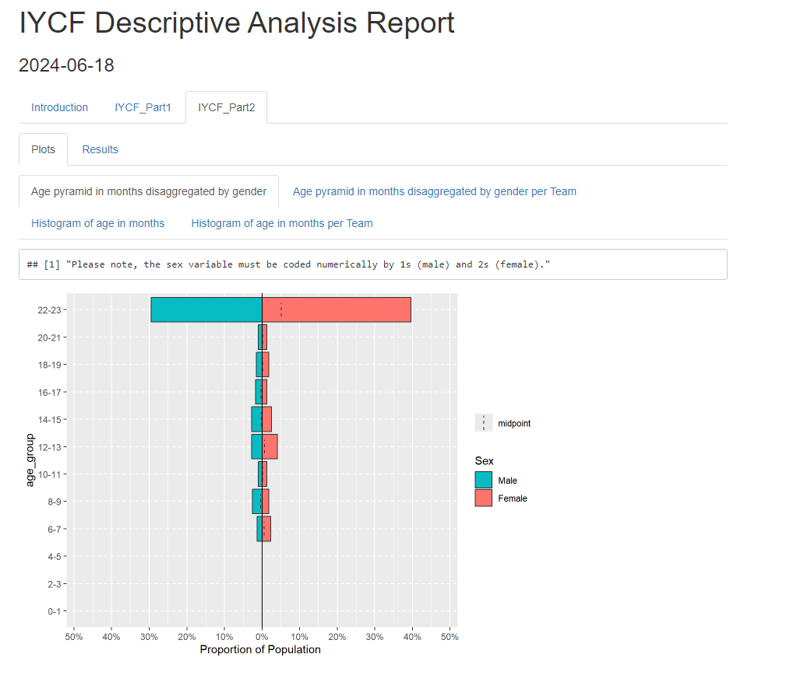

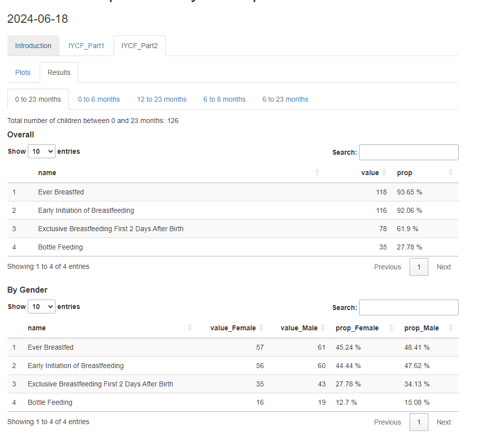

### Integrated Public Health Tables

The Integrated Table serves as a comprehensive tool for evaluating
public health outcomes and related contributing factors through severity
categorization based on existing or tailored standards. These categories
are set by thresholds across 5 different levels (Extremely High, Very
High, High, Moderate, Low). The core indicators were selected against
the Risk of Excess Loss of Life conceptual framework internal to REACH
Initiative. Additionally, other relevant indicators or data (IPC AMN
classification for instance) can be added manually to the table, in
consultation with PHU if support is needed to identify indicators or
thresholds.

Here is a table showing the different indicators and the thresholds

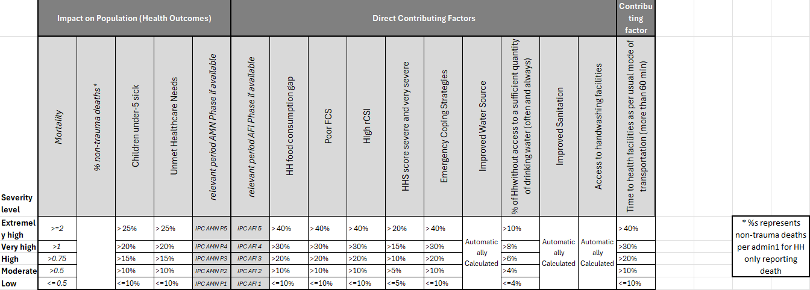

#### Impact on Population (Health Outcomes)

<ul>
<li>
Mortality: Crude Mortality Rates
</li>
<li>
% non-trauma deaths: %s respresents non-trauma related causes of death
for HHs only reporting death
</li>
<li>
Children under-5 sick: %s of under-5 individuals reported being sick.
</li>
<li>
Unmet Healthcare Needs: %s of individuals reporting needing healthcare
needs but not receiving it.
</li>
<li>
relevant period AMN Phase if available: IPC AMN Phases (1-5)
</li>
</ul>

Mortality related indicators will only show if Mortality data was
collected. If so, another excel document will be required, and it is
generated by running the Mortality Descriptive Analysis project.

#### Direct Contributing Factors

<ul>
<li>
relevant period AFI Phase if available: IPC AFI Phases (1-5)
</li>
<li>
HH food consumption gap: %s of HH reported Food Consumption Matrix 3-4-5
</li>
<li>
Poor FCS: %s of HH reported poor Food Consumption Score
</li>
<li>
High rCSI: %s of HH reported high Reduced Coping Strategies Index
</li>
<li>
HHS score severe and very severe: %s of HH reported severe and very
severe Household Hunger Scale score
</li>
<li>
Emergency Coping Strategies: %s of HH reported emergency Livelihood
Coping Strategies Index
</li>
<li>
Improved Water Source: %s of HH reported having improved drinking water
sources
</li>
<li>
Water Quantity: %s of HH without access to a sufficient quantity of
drinking water
</li>
<li>
Improved Sanitation: %s of HH reported having improved sanitation
facilities
</li>
<li>
Access to handwashing facilities: %s of HH reported having access to
handwashing facilities
</li>
</ul>

Please note that Improved Water Source/Improved Sanitation/and Access to
handwashing facilities thresholds are dynamically calculated using the
distribution of the data (following the guidances from WASH cluster).

The median, 1st quantile, 3rd quantile, and the IQR (3rd quantile - 1st
quantile) are calculated and the thresholds are set as following:

<ul>
<li>
Extremely High: \< 1st quantile - IQR
</li>
<li>
Very High: \< 1st quantile
</li>
<li>
High: \< Median
</li>
<li>
Moderate: \< 3rd quantile
</li>
<li>
Low: \>= 3rd quantile
</li>
</ul>

However if (1st quantile - IQR) for the Extremely High threshold is
yielding a negative value, the IQR is flipped to be added to the Low
threshold as following:

<ul>
<li>
Extremely High: \< 1st quantile
</li>
<li>
Very High: \< Median
</li>
<li>
High: \< 3rd quantile
</li>
<li>
Moderate: \< 3rd quantile + IQR
</li>
<li>
Low: \>= 3rd quantile + IQR
</li>
</ul>

#### Contributing Factors

<ul>
<li>
Time to health facilities as per usual mode of transportation: %s of HHs
reported taking more than 60 min to reach health facilities
</li>
</ul>

The project will follow a user input requirements method. Some of the
WASH inputs might require visiting the [humind
package](https://impact-initiatives-hppu.github.io/humind/), to
understand the categories of the improved/unimproved drinking water and
sanitation questions and potentially other indicators.

#### Execution

Once the project is selected and saved as shown in the previous section,
automatically the respective file that you need to run will open. First
thing, you should select all the line codes in the file, and click run
as shown in the following picture.


The next step will requires you to answer/click/select/input some
information related to the sector that you are trying to check the
quality for. Generally this will include:
<ul>
<li>
Data that includes the above mentioned indicators
</li>
<li>
If mortality collected, the PH Integrated related excel file outputted
from the Mortality Descriptive Analysis Project
</li>
<li>
Inputs of specific columns/values that will be targeted within the
quality check.
</li>
</ul>

After running all the line in the run_ph_integrated_tables.R, below are
the set of inputs that are required for you to select/fill.
<strong>Please note that if the script is asking for a value that is not
in your data, then you should select cancel. However, make sure with the
respective focal point if these variables are required to get the
desired output.</strong>

<details>
<summary>
<h4>
Details
</h4>
</summary>

> `Data` \<- Dataset.<br> If mortality collected:<br>
> `Mortality related output` \<- Related mortality integrated outputed
> from the descriptive analysis script<br> `Is your data weighted` \<-
> Question to check if your data is weighted (Yes/No).<br> `Weight` \<-
> If yes, select the weight column in your data. <br> `Death Cause` \<-
> Cause of Death column in died members individual sheet<br>
> `HH UUID Died column` \<- Household unique identifier in died members
> individual sheet(usually \_submission\_\_uuid)<br> `Admin 1` \<- Admin
> 1 column<br> `FSL indicators` \<- FSL indicators you have collected in
> your data.<br> `fsl_fcs_cereal`\<- Cereal Column related to Food
> Consumption Score <br> `fsl_fcs_legumes`\<- Legumes Column related to
> Food Consumption Score <br> `fsl_fcs_veg`\<- Vegetables Column related
> to Food Consumption Score <br> `fsl_fcs_fruit`\<- Fruit Column related
> to Food Consumption Score <br> `fsl_fcs_meat`\<- Meat Column related
> to Food Consumption Score <br> `fsl_fcs_dairy`\<- Dairy Column related
> to Food Consumption Score <br> `fsl_fcs_sugar`\<- Sugar Column related
> to Food Consumption Score <br> `fsl_fcs_oil`\<- Oil Column related to
> Food Consumption Score <br> If rCSI selected<br>
> `fsl_rcsi_lessquality` \<- rCSI Less Quality Food Column<br>
> `fsl_rcsi_borrow` \<- rCSI Borrowing Food Column<br>
> `fsl_rcsi_mealsize` \<- rCSI Reducing Meal Size Column<br>
> `fsl_rcsi_mealadult` \<- rCSI Reduce Meals For Adults and Prioritize
> Child Meals Column<br> `fsl_rcsi_mealnb` \<- rCSI Reduce Meal Numbers
> Column<br> If HHS selected<br> `fsl_hhs_nofoodhh` \<- HHS No Food in
> the Household Column<br> `fsl_hhs_nofoodhh_freq` \<- HHS Frequency No
> Food in the Household Column<br> `fsl_hhs_sleephungry` \<- HHS
> Sleeping Hungry Column<br> `fsl_hhs_sleephungry_freq` \<- HHS
> Frequency Sleeping Hungry Column<br> `fsl_hhs_alldaynight` \<- HHS All
> Day and Night Without Eating Column<br> `fsl_hhs_alldaynight_freq` \<-
> HHS All Day and Night Without Eating Column<br> `Yes Value` \<- HHS
> Yes value<br> `No Value` \<- HHS No value<br> `Rarely Value` \<- HHS
> Frequency Rarely value<br> `Sometimes Value` \<- HHS Frequency
> Sometimes value<br> `Often Value` \<- HHS Frequency Often value<br> If
> LCSI selected: 4 LCSI Stress, 3 LCSI Crisis, and 3 LCSI Emergency are
> required<br> `fsl_lcsi_stress1` \<- LCSI Stress 1 Column<br>
> `fsl_lcsi_stress2` \<- LCSI Stress 2 Column<br> `fsl_lcsi_stress3` \<-
> LCSI Stress 3 Column<br> `fsl_lcsi_stress4` \<- LCSI Stress 4
> Column<br> `fsl_lcsi_crisis1` \<- LCSI Crisis 1 Column<br>
> `fsl_lcsi_crisis1` \<- LCSI Crisis 1 Column<br> `fsl_lcsi_crisis2` \<-
> LCSI Crisis 2 Column<br> `fsl_lcsi_emergency2` \<- LCSI Emergency 2
> Column<br> `fsl_lcsi_emergency3` \<- LCSI Emergency 3 Column<br>
> `fsl_lcsi_emergency3` \<- LCSI Emergency 3 Column<br> `Yes Value` \<-
> LCSI Yes value<br> `No Value` \<- LCSI No had no need value<br>
> `Exhausted Value` \<- LCSI No exhausted value<br>
> `Not Applicable Value` \<- LCSI Not Applicable value<br> `Yes Value`
> \<- HDDS Yes value<br> `No Value` \<- HDDS No value<br>
> `Survey modality` \<- Survey Modality column (remote/face-to-face)<br>
> `Handwashing Facility` \<- Handwashing Facility column<br> `Yes Value`
> \<- Yes Value for Handwashing Facility Question<br> `None Value` \<-
> None Value for Handwashing Facility Question<br> `No Permission Value`
> \<- No Permission Value for Handwashing Facility Question<br>
> `Other Value` \<- Other Value for Handwashing Facility Question<br>
> `Handwashing Facility Observed Water` \<- Handwashing Facility Water
> Observed column<br> `Yes Value` \<- Yes Value for Handwashing Facility
> Observed Water Question<br> `No Value` \<- No Value for Handwashing
> Facility Observed Water Question<br>
> `Handwashing Facility Observed Soap` \<- Handwashing Facility Soap
> Observed column<br> `Yes Value` \<- Yes Value for Handwashing Facility
> Observed Soap Question<br> `No Value` \<- No Value for Handwashing
> Facility Observed Soap Question<br> `Alternative Value` \<-
> Alternative Value for Handwashing Facility Observed Soap Question<br>
> `Handwashing Facility Reported` \<- Handwashing Facility Reported
> column<br> `Yes Value` \<- Yes Value for Handwashing Facility Reported
> Question<br> `No Value` \<- No Value for Handwashing Facility Reported
> Question<br> `Undefined Value` \<- Undefined Value for Handwashing
> Facility Reported Question<br> `Reported No Permission Soap` \<-
> Reported No Permission Soap column<br> `Yes Value` \<- Yes Value for
> Reported No Permission Soap Question<br> `No Value` \<- No Value for
> Reported No Permission Soap Question<br> `Undefined Value` \<-
> Undefined Value for Reported No Permission Soap Question<br>
> `Reported No Permission Soap Type` \<- Reported No Permission Soap
> Type column<br> `Yes Value` \<- Yes Value for Reported No Permission
> Soap Type Question<br> `No Value` \<- No Value for Reported No
> Permission Soap Type Question<br> `Undefined Value` \<- Undefined
> Value for Reported No Permission Soap Type Question<br>
> `Reported Remote Soap` \<- Reported Reported Remote Soap column<br>
> `Yes Value` \<- Yes Value for Reported Remote Soap Question<br>
> `No Value` \<- No Value for Reported Remote Soap Question<br>
> `Undefined Value` \<- Undefined Value for Reported Remote Soap
> Question<br> `Reported Remote Soap Type` \<- Reported Reported Remote
> Soap Type column<br> `Yes Value` \<- Yes Value for Reported Remote
> Soap Type Question<br> `No Value` \<- No Value for Reported Remote
> Soap Type Question<br> `Undefined Value` \<- Undefined Value for
> Reported Remote Soap Type Question<br> `Drinking Water Source` \<-
> Main Source of Drinking Water Question<br> `Improved Value` \<-
> Improved Value for Main Source of Drinking Water Question<br>
> `Unimproved Value` \<- Unimproved Value for Main Source of Drinking
> Water Question<br> `Surface Water Value` \<- Surface Water Value for
> Main Source of Drinking Water Question<br> `Undefined Value` \<-
> Undefined Value for Main Source of Drinking Water Question<br>
> `Sanitation Facility` \<- Toilet Sanitation Facility Question<br>
> `Improved Value` \<- Improved Value forToilet Sanitation Facility
> Question<br> `Unimproved Value` \<- Unimproved Value for Toilet
> Sanitation Facility Question<br> `None Value` \<- None Value for
> Toilet Sanitation Facility Question<br> `Undefined Value` \<-
> Undefined Value for Toilet Sanitation Facility Question<br>
> `Drinking Water Quantity` \<- Drinking Water Quantity Question<br>
> `Travel Time to Health Facility` \<- Travel Time to Health Facility
> Question<br> `Healthcare Sheet` \<- Healthcare Individual Sheet<br>
> `Healthcare is Needed Column` \<- Healthcare is Needed Column<br>
> `Healthcare is Received Column` \<- Healthcare is Received Column<br>
> `Individual Age Column` \<- Individual Age Column<br>
> `HH UUID Health Loop column` \<- Household unique identifier in health
> members individual sheet(usually \_submission\_\_uuid)<br>
> `HH UUID Main Sheet column` \<- Household unique identifier in main
> household sheet(usually \_uuid)<br> `Nutrition Sheet` \<- Nutrition
> Individual Sheet<br> `Under 5 Sick column` \<- Under 5 Sick column<br>
> `Yes Value` \<- Yes Value for Under 5 Sick column<br> `No Value` \<-
> No Value for Under 5 Sick column<br> `Undefined Value` \<- Undefined
> Value for Under 5 Sick column<br> `HH UUID Nutrition Loop column` \<-
> Household unique identifier in nutrition members individual
> sheet(usually \_submission\_\_uuid)<br>

</details>

The output will include 3 sheets:

<ul>
<li>
instructions: information about all the indicators and the thresholds,
even the WASH calculated ones
</li>
<li>
Data: %s and values by Admin 1 and National levels
</li>
<li>
Cat: Categories of the indicators by Admin 1 and National levels
</li>
</ul>

Here is an example (dummy Somalia Data):


### IPHRA

The use case for this toolkit is intended to be in acute crises where
there is a realistic possibility of deterioration of public health
outcomes in the population to be assessed. This is not intended to be an
urgent rapid assessment done within the first 72 hours, which tend to be
more qualitative, but instead the intended timeline should be after an
initial stabilization of a situation and population movements, maybe one
month after an initial shock or hazard, depending on the situation. The
general objective and purpose of an IPHRA assessment is “to assess the
severity of the public health situation and identify initial public
health priorities for response to mitigate excess morbidity,
malnutrition, and mortality.”

Please follow the instructions provided in the recorded training
sessions as well as powerpoints in the
<a href = "https://acted.sharepoint.com/:f:/r/sites/IMPACT-Public_health/Shared%20Documents/Toolkits/Cross-cutting/Integrated%20Public%20Health%20Rapid%20Assessment%20Toolkit%20(IPHRA)/4.%20Training%20Materials?csf=1&web=1&e=XehtzM">PHU
Intranet Page</a> to learn how to run the scripts.

<strong>Disclaimer: These scripts are only built to run IPHRA tools and
assessments. Please make sure to follow the guidance provided in the
Intranet to be able to run the scripts successfully.</strong>

#### Quality Report and Plausibility Checks

The Data Quality and Plausibility Report serves as a crucial tool for
assessing the reliability and accuracy of the IPHRA data collection
across different sectors such as Nutrition, Mortality, Water, Sanitation
and Hygiene (WASH), Food Security, and Livelihoods. This comprehensive
analysis is designed to identify and address potential issues within the
data, ensuring that field teams are being informed on potential issues
detected in the data collection.each of these sectors, the report
provides a detailed examination of the datasets, employing a variety of
metrics and methodologies to evaluate data quality and plausibility.
This includes checks for completeness, consistency, and accuracy of the
data collected. This report aims to uncover any discrepancies, outliers,
or anomalies that may suggest data collection, entry errors, or
underlying issues that could impact the integrity of the findings.

#### Cleaning

The IPHRA Cleaning toolkit is a tailored project to clean the collected
data following IMPACT’s guidance of quantitative data cleaning. The
project is divided in batches files that can be ran outside of R Studio
to reduce the interactions with R and allow any person run the scripts.
You are required to have R Tools and RStudio installed on your device to
be able to run the scripts.

#### Analysis

The IPHRA Tabular Analysis is an analytical platform that presents a
multitude of quantitative data tables. It encompasses a wide range of
indicators collected through the IPHRA assessment process, empowering
users to examine and interpret complex datasets effectively. This tool
is structured to support understanding the distribution of your data and
support you writing your factsheets/outputs/reports, and create other
visualizations.

## Potential Errors and How to fix them

During the run of the integrated projects, some errors might occur. <br>
Please see some of these errors that were already caught and the way to
solve them.

### lazy-load Error

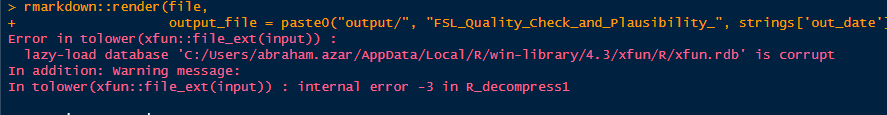 This error usually appears after the
scripts taking some time (5-10 mins) to load due to the upload of the
packages. <br> To solve this issue, only restart the session or R by
going to the tab part -\> Session -\> Restart R (or CTRL + SHIFT + F10),
and rerun the script again.

### ‘make’ not found

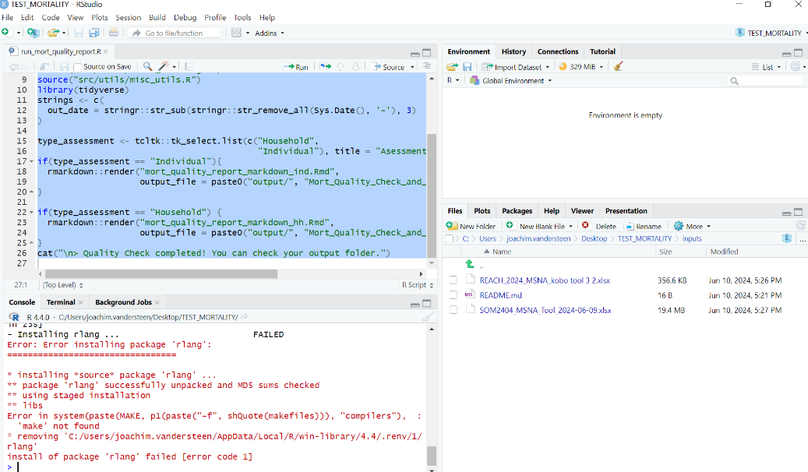 This error usually appears during the
installation of packages the first time you are running the scripts. The
projects are wrapped within something called R Environment that
automatically install and load the necessary packages for the project.
Some of these packages are constantly maintained by their owners and new
versions are deployed regularly. The script try to check for any updates
in the package and upload the newest. However, if the error still shows,
specially with <strong>Error: Error Installing package ‘XXXX’</strong>,
you have two options.
<ul>
<li>
If you are comfortable handling some debugging, please try to find the
latest version of the mentioned package in the error in the web, usually
searching (PACKAGE NAME latest version in r) show you something called
the CRAN where you can see the latest version. Then, open renv.lock, and
target the actual package (attention, not where it is mentioned as
dependency to another package), then replace the version with the latest
one. Please do contact Abraham Azar
(<abraham.azar@impact-initiatives.org>) or the PHU team
(<impact.geneva.phu@impact-initiatives.org>) mentioning the updated
package name and the version.
</li>
<li>
If the first point was gibberish to you, directly contact Abraham Azar
(<abraham.azar@impact-initiatives.org>) or the PHU team
(<impact.geneva.phu@impact-initiatives.org>) with the error.
</li>
</ul>

### Wrong dates in mortality

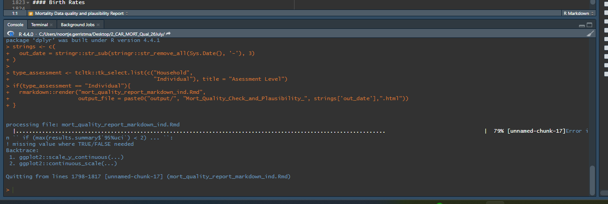

If the above error appears while running the mortality quality report or
descriptive analysis projects, this means that you have a possible issue
between the birth dates and the death dates in the death loop. Most
probably, one of the death have a recorded birth date after the recorded
death date. Make sure to fix the dates before running the scripts.

### GitHub Error

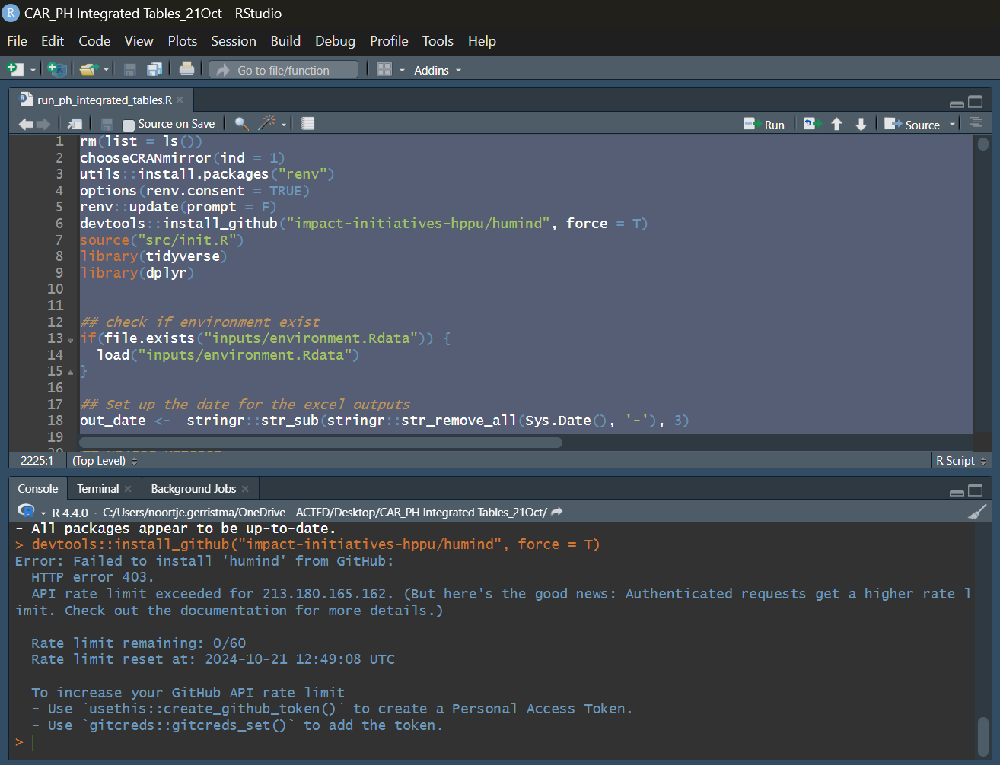

If the above error appears while running the PH integrated Tables
projects, this means that you or other people have reached the maximum
amount of downloads for a specific package (humind here) from GitHub. To
fix the issue, you need to wait until the Rate Limit Reset Time is
reached as shown in the picture.

If any other error is hindering you to run the whole script, or any
other semantic issues (output do not make any sense), please contact
Abraham Azar (<abraham.azar@impact-initiatives.org>) or the PHU team
(<impact.geneva.phu@impact-initiatives.org>) with the error/issue.

## Standalone Functions (for both Analysis or Quality checks)

``` r
library(impactR4PHU)
df <- impactR4PHU_data_template
```

### FSL ADD Indicators

#### Example:: Add Food Consumption Score (FCS)

``` r
df_with_fcs <- df %>% add_fcs(
  cutoffs = "normal",
  fsl_fcs_cereal = "fsl_fcs_cereal",
  fsl_fcs_legumes = "fsl_fcs_legumes",
  fsl_fcs_veg = "fsl_fcs_veg",
  fsl_fcs_fruit = "fsl_fcs_fruit",
  fsl_fcs_meat = "fsl_fcs_meat",
  fsl_fcs_dairy = "fsl_fcs_dairy",
  fsl_fcs_sugar = "fsl_fcs_sugar",
  fsl_fcs_oil = "fsl_fcs_oil"
)
```

#### Example:: Add Household Hunger Scale (HHS)

``` r
df_with_hhs <- df_with_fcs %>% add_hhs(
  fsl_hhs_nofoodhh = "fsl_hhs_nofoodhh",
  fsl_hhs_nofoodhh_freq = "fsl_hhs_nofoodhh_freq",
  fsl_hhs_sleephungry = "fsl_hhs_sleephungry",
  fsl_hhs_sleephungry_freq = "fsl_hhs_sleephungry_freq",
  fsl_hhs_alldaynight = "fsl_hhs_alldaynight",
  fsl_hhs_alldaynight_freq = "fsl_hhs_alldaynight_freq",
  yes_answer = "yes",
  no_answer = "no",
  rarely_answer = "rarely",
  sometimes_answer = "sometimes",
  often_answer = "often"
)
```

#### Example:: Add Livelihood Coping Strategy score (LCSI)

``` r
df_with_lcsi <- df_with_hhs %>% add_lcsi(
  fsl_lcsi_stress1 = "fsl_lcsi_stress1",
  fsl_lcsi_stress2 = "fsl_lcsi_stress2",
  fsl_lcsi_stress3 = "fsl_lcsi_stress3",
  fsl_lcsi_stress4 = "fsl_lcsi_stress4",
  fsl_lcsi_crisis1 = "fsl_lcsi_crisis1",
  fsl_lcsi_crisis2 = "fsl_lcsi_crisis2",
  fsl_lcsi_crisis3 = "fsl_lcsi_crisis3",
  fsl_lcsi_emergency1 = "fsl_lcsi_emergency1",
  fsl_lcsi_emergency2 = "fsl_lcsi_emergency2",
  fsl_lcsi_emergency3 = "fsl_lcsi_emergency3",
  yes_val = "yes",
  no_val = "no_had_no_need",
  exhausted_val = "no_exhausted",
  not_applicable_val = "not_applicable"
)
```

#### Example:: Add Reduced Household Coping Strategy score (rCSI)

``` r
df_with_rcsi <- df_with_lcsi %>% add_rcsi(
  fsl_rcsi_lessquality = "fsl_rcsi_lessquality",
  fsl_rcsi_borrow = "fsl_rcsi_borrow",
  fsl_rcsi_mealsize = "fsl_rcsi_mealsize",
  fsl_rcsi_mealadult = "fsl_rcsi_mealadult",
  fsl_rcsi_mealnb = "fsl_rcsi_mealnb"
)
```

#### Example:: Add Household Dietary Diversity Score (HDDS)

``` r
df_with_hdds <- df_with_rcsi %>% add_hdds(
   fsl_hdds_cereals = "fsl_hdds_cereals",
   fsl_hdds_tubers = "fsl_hdds_tubers",
   fsl_hdds_veg = "fsl_hdds_veg",
   fsl_hdds_fruit = "fsl_hdds_fruit",
   fsl_hdds_meat = "fsl_hdds_meat",
   fsl_hdds_eggs = "fsl_hdds_eggs",
   fsl_hdds_fish = "fsl_hdds_fish",
   fsl_hdds_legumes = "fsl_hdds_legumes",
   fsl_hdds_dairy = "fsl_hdds_dairy",
   fsl_hdds_oil = "fsl_hdds_oil",
   fsl_hdds_sugar = "fsl_hdds_sugar",
   fsl_hdds_condiments = "fsl_hdds_condiments"
)
```

#### Example:: Add Food Consumption Matrix (FCM) using FCS, RCSI, and HHS

**Notice that these functions are also pipable**

``` r
df_with_fcm_1 <- df_with_hdds %>%
  add_fcm_phase(
    fcs_column_name = "fsl_fcs_cat",
    rcsi_column_name = "fsl_rcsi_cat",
    hhs_column_name = "fsl_hhs_cat_ipc",
    fcs_categories_acceptable = "Acceptable",
    fcs_categories_poor = "Poor",
    fcs_categories_borderline = "Borderline",
    rcsi_categories_low = "No to Low",
    rcsi_categories_medium = "Medium",
    rcsi_categories_high = "High",
    hhs_categories_none = "None",
    hhs_categories_little = "Little",
    hhs_categories_moderate = "Moderate",
    hhs_categories_severe = "Severe",
    hhs_categories_very_severe = "Very Severe"
  )
```

#### Example:: Add Food Consumption Matrix (FCM) using HDDS, RCSI, and HHS

**Notice that these functions are also pipable**

``` r
df_with_fcm_2 <- df_with_hdds %>%
  add_fcm_phase(
    hdds_column_name = "fsl_hdds_cat",
    rcsi_column_name = "fsl_rcsi_cat",
    hhs_column_name = "fsl_hhs_cat_ipc",
    hdds_categories_low = "Low",
    hdds_categories_medium = "Medium",
    hdds_categories_high = "High",
    rcsi_categories_low = "No to Low",
    rcsi_categories_medium = "Medium",
    rcsi_categories_high = "High",
    hhs_categories_none = "None",
    hhs_categories_little = "Little",
    hhs_categories_moderate = "Moderate",
    hhs_categories_severe = "Severe",
    hhs_categories_very_severe = "Very Severe"
  )
```

#### Example:: Add Food Consumption Matrix (FCM) using FCS and HHS

**Notice that these functions are also pipable**

``` r
df_with_fcm_3 <- df_with_hdds %>%
  add_fcm_phase(
    fcs_column_name = "fsl_fcs_cat",
    hhs_column_name = "fsl_hhs_cat_ipc",
    fcs_categories_acceptable = "Acceptable",
    fcs_categories_poor = "Poor",
    fcs_categories_borderline = "Borderline",
    hhs_categories_none = "None",
    hhs_categories_little = "Little",
    hhs_categories_moderate = "Moderate",
    hhs_categories_severe = "Severe",
    hhs_categories_very_severe = "Very Severe"
  )
```

#### Example:: Add Food Consumption Matrix (FCM) using HDDS and HHS

**Notice that these functions are also pipable**

``` r
df_with_fcm_4 <- df_with_hdds %>%
  add_fcm_phase(
    hdds_column_name = "fsl_hdds_cat",
    hhs_column_name = "fsl_hhs_cat_ipc",
    hdds_categories_low = "Low",
    hdds_categories_medium = "Medium",
    hdds_categories_high = "High",
    hhs_categories_none = "None",
    hhs_categories_little = "Little",
    hhs_categories_moderate = "Moderate",
    hhs_categories_severe = "Severe",
    hhs_categories_very_severe = "Very Severe"
  )
```

#### Example:: Add FEWSNET Food Consumption-Livelihood Matrix (FCLCM)

**Notice that these functions are also pipable**

``` r
df_with_fclcm <- df_with_fcm_1 %>% ## Taken from previous Example
  add_fclcm_phase()
```

### NUTRITION ADD Indicators

``` r
df_nut <- impactR4PHU_data_nut_template
```

#### Example:: Add MUAC

``` r
df_with_muac <- df_nut %>% 
  add_muac()
```

#### Example:: Add MFAZ

``` r
df_with_mfaz <- df_with_muac %>% 
  add_mfaz()
```

    ## ================================================================================

#### Example:: Add IYCF

``` r
df_iycf <- impactR4PHU_iycf_template_data
df_with_iycf <- df_iycf %>% 
  add_iycf(uuid = "_submission__uuid",
           age_months = "child_age_months_2")
```

### Checking Flags

``` r
tool <- impactR4PHU_survey_template
```

#### Example:: Check Food Security and Livelihoods Flags

``` r
fsl_flags <- df_with_fclcm %>% 
  check_fsl_flags()
```

#### Example:: Check Anthropometric Flags

``` r
anthro_flags <- df_with_mfaz %>% 
  check_anthro_flags(loop_index = "loop_index")
```

#### Example:: Check WASH Flags

``` r
container_df <- impactR4PHU_data_wash_template
wash_flags <- df %>% 
  check_wash_flags(data_container_loop = container_df)
```

    ## Joining with `by = join_by(uuid)`

#### Example:: Check Health Flags (to add more flags related to WGSS)

``` r
msna_data <- impactR4PHU_MSNA_template_data
health_flags <- check_health_flags(
  .dataset = msna_data
)
```

#### Example:: Check IYCF Flags

``` r
iycf_flags <- check_iycf_flags(
  .dataset = df_with_iycf,
  age_months = "child_age_months_2",
  uuid = "_submission__uuid"
)
```

## Credits

This R package is an optimized version of Saeed Rahman’s
[healthyR](https://github.com/SaeedR1987/healthyr) package, developed by
Abraham Azar. It incorporates additional improvements and features to
support public health data cleaning/analysis. Contributions to this
package also come from [Yann Say](https://github.com/yannsay-impact),
the
[apyramid](https://cran.r-project.org/web/packages/apyramid/vignettes/intro.html)
package from R4EPIs projects, and the Public Health Unit at IMPACT
Initiatives.

For any questions or further information, please contact: - Abraham Azar
at <abraham.azar@impact-initiatives.org>. - IMPACT GENEVA Public Health
Unit at <impact.geneva.phu@impact-initiatives.org>

## Code of Conduct

Please note that the impactR4PHU project is released with a [Contributor
Code of
Conduct](https://impact-initiatives.github.io/impactR4PHU/CODE_OF_CONDUCT.html).
By contributing to this project, you agree to abide by its terms.
