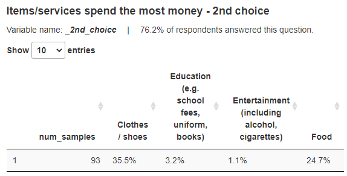
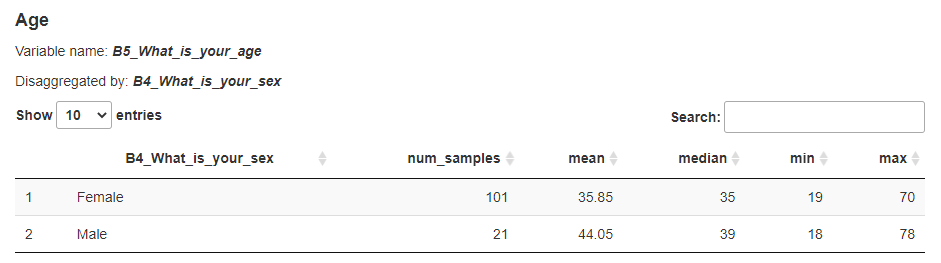
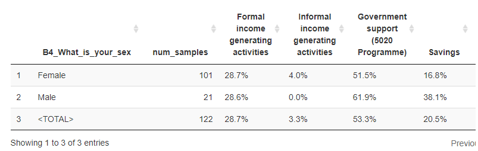

# tabular_analysis_boilerplate_v2

Welcome to the repository for v2 of tabular analysis: now with rewritten backend!

This is a template repository containing scripts and the necessary folder structure to get you started with building your tabular analysis.

## how to use this?

Two options to get a working copy of this repo:
    
1. click the "Use this template" button to create a new git repository
2. download this repository as a ZIP, unpack, rename this folder as necessary and start working!

Then:

- update to the latest version of the [utility_repo](https://github.com/REACH-WoU-Regional/utility_repo) submodule 
- put the necessary files into the _resources_ folder: DAF and the Kobo tool
- put your final data in the 'data' folder
- replace all the "???"s in `strings` in `run_analysis.R`
- add disaggregations & grouping variables in `format_dataset.R`

## CHANGELOG (what's new in v2?)

plenty of small improvements & additions, for example: for each question, the percentage of people who gave a response

### code:

some functionality has been moved to separate R scripts:
- fixing bugged choices and variable names -> `fix_bugged_names.R`
- converting columns -> `convert_cols_with_daf.R`
- adding grouping variables -> `format_dataset.R`

Hopefully this will make it easier to debug this script!

### the new DAF:
- all columns are optional except for __variable__ and __section__ (but section could be made optional too, if we use group names from `tool.survey`)
    - __label__: by default takes the label of the question from the tool
    - __calculation, disaggregations__: by default NA
    - __comments__: by default "" (empty strings)
    - __func__: by default uses _var_type_ (taken from `tool.survey`)
    - __admin__: by default equal to "strata" if this column exists in the data, otherwise "overall"

> default values are set in the ``init.R`` file, when the DAF is being loaded, but some are also calculated per-entry in the `load_entry` function

#### **disaggregations**:
as before, provide the variable name which will be used to disaggregate. You can specify more than one, by separating the names with semicolon ( ; )

#### **admin**:
same behavior as before. All data will be grouped by the provided admin column, unless admin=="overall"

#### **func**:
- major change: 'mean' and 'median' have been combined and renamed to 'numeric'. This func also outputs the min and max values for a variable.

- 'select_one/_multiple' provide the same tables as previously, with an option for providing the Totals, if the variable was disaggregated (example below)

#### **calculation**:
you can set specific flags here which affect the outputted tables: you can provide any or all of these keywords:
- `include_na` - to include NAs as one of the factor levels. Applicable only for 'select_one/multiple'
- `add_total` - to include a row with Totals. Applicable only when the table is disaggregated.
- `join` - not implemented yet

    So, for example, if you'd like to include NAs for some table, and also have the Totals row, you can put into the __calculation__ column this string: "add_total, include_na".

    "include_naadd_total" would also work, because `load_entry` simply detects the presence of a regex pattern in this column
    
## what's next to do?

- 'count' still needs to be re-implemented (shouldn't be too dificult). For select-multiples, this func should give the numbers for each choice. For select-ones and text questions, this should be simply a group_by(entry$variable), then summarize(n = n())
- additional __calculation__ flags could be added (for example, "unweighted")
